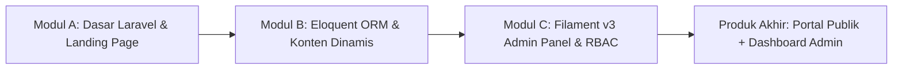
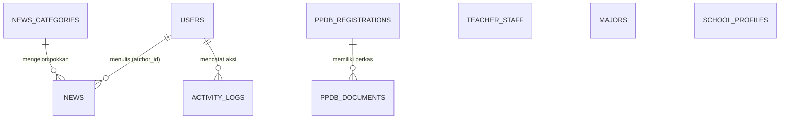

# 📘 Modul Pembelajaran & Bank Soal — Program Magang Laravel 11 & Filament v3

## 🏫 Studi Kasus: Sistem Informasi & Website Profil PKBM Tahfizh At-Tamam (Attamam Edu)

---

## 📌 Informasi Umum & Peta Kurikulum

Dokumen ini disusun sebagai panduan materi pembelajaran dan evaluasi berkala bagi peserta magang Rekayasa Perangkat Lunak (RPL). Seluruh materi dan latihan diselaraskan langsung dengan kondisi nyata repositori kode **Attamam Edu**.

### 🛠️ Stack Teknologi Proyek
* **Framework Backend:** Laravel 11.x (PHP 8.2+)
* **Admin Panel:** Filament Panels v3.x (TALL Stack: Tailwind CSS, Alpine.js, Laravel, Livewire)
* **Frontend:** Blade Templating, Tailwind CSS, Vite
* **Database:** MySQL 8.x
* **Autentikasi & RBAC:** Filament Auth Guard, Multi-Role (`super_admin`, `admin_cms`, `admin_ppdb`, `editor_akademik`)
* **Version Control:** Git & GitHub Workflow



---

# 🚀 MODUL A (Minggu 1–2) — Dasar Laravel 11, Routing & Master Layout Landing Page

### 🎯 Tujuan Pembelajaran
Setelah menyelesaikan Modul A, peserta diharapkan mampu:
1. Memahami arsitektur **MVC (Model-View-Controller)** dan siklus request di Laravel 11.
2. Mengonfigurasi environment (`.env`) dan menjalankan server lokal.
3. Menyusun **Routing** yang terstruktur (`Route::get`, `Route::post`, named route).
4. Mengimplementasikan **Controller** untuk menangani data dan pemrosesan formulir.
5. Membangun tata letak modular menggunakan **Blade Layout** (`@extends`, `@yield`, `@section`, `@include`).
6. Membuat **Blade Component Reusable** (`<x-card>`, `<x-stat-card>`, `<x-section-header>`).
7. Memproses formulir publik dengan validasi input (`$request->validate()`) dan flash message (`session('success')`).

---

### 📖 A. Ringkasan Materi Teknis

#### 1. Arsitektur Laravel 11 & Siklus Request
Pada Laravel 11, struktur aplikasi dirancang lebih ramping (*lean*). Konfigurasi middleware dan routing yang sebelumnya berada di `app/Http/Kernel.php` kini dipusatkan di file [`bootstrap/app.php`](file:///D:/Website%20Attamam%20Edu/AttamamEdu/bootstrap/app.php).
* **Alur Request:** Browser Request $\rightarrow$ `routes/web.php` $\rightarrow$ `Controller` $\rightarrow$ `View (Blade)` $\rightarrow$ Response HTML ke Browser.

#### 2. Routing Publik (`routes/web.php`)
Di proyek Attamam Edu, rute publik didefinisikan secara bersih:
```php
use App\Http\Controllers\SchoolController;

// Halaman utama landing page
Route::get('/', [SchoolController::class, 'index'])->name('home');

// Submit formulir kontak / pendaftaran cepat PPDB
Route::post('/kontak', [SchoolController::class, 'submitContact'])->name('kontak.submit');
```

#### 3. Master Layout & Blade Templating
Menggunakan konsep *Don't Repeat Yourself (DRY)* dengan memisahkan layout utama ([`resources/views/layouts/app.blade.php`](file:///D:/Website%20Attamam%20Edu/AttamamEdu/resources/views/layouts/app.blade.php)) serta komponen navigasi ([`resources/views/partials/navbar.blade.php`](file:///D:/Website%20Attamam%20Edu/AttamamEdu/resources/views/partials/navbar.blade.php)) dan footer:
```html
<!DOCTYPE html>
<html lang="id">
<head>
    <meta charset="UTF-8">
    <title>@yield('title', 'PKBM Tahfizh At-Tamam')</title>
    <link rel="stylesheet" href="{{ asset('css/style.css') }}">
</head>
<body>
    @include('partials.navbar')

    @if(session('success'))
        <div class="alert alert-success">{{ session('success') }}</div>
    @endif

    <main>
        @yield('konten_utama')
    </main>

    @include('partials.footer')
</body>
</html>
```

#### 4. Blade Components Reusable
Komponen UI modular dibuat di folder `resources/views/components/`:
* `<x-card title="..." badge="..." icon="...">` untuk menampilkan kartu jurusan dan program.
* `<x-stat-card label="..." value="..." icon="...">` untuk menampilkan baris data statistik sekolah.
* `<x-section-header tag="..." title="..." subtitle="...">` untuk standardisasi judul tiap bagian.

#### 5. Form Handling & Validasi di `SchoolController.php`
Pengolahan data POST dari pengunjung dilakukan dengan validasi ketat dan pesan galat berbahasa Indonesia:
```php
public function submitContact(Request $request)
{
    $validated = $request->validate([
        'nama' => 'required|min:3',
        'email' => 'required|email',
        'jurusan_minat' => 'required',
        'pesan' => 'required|min:10',
        'berkas' => 'nullable|file|mimes:pdf,jpg,jpeg,png|max:2048',
    ]);

    // Simpan ke database & catat log aktivitas
    // Redirect kembali dengan flash message
    return redirect()->back()->with('success', 'Formulir berhasil terkirim!');
}
```

---

### 📝 B. Bank Soal Modul A

#### Bagian I: Pilihan Ganda (10 Soal)

1. Pada Laravel 11, tempat utama untuk meregistrasikan middleware kustom dan alias middleware adalah...
   - a. `app/Http/Kernel.php`
   - b. `bootstrap/app.php`
   - c. `config/app.php`
   - d. `routes/web.php`

2. Perhatikan potongan kode berikut: `Route::get('/profil', [SchoolController::class, 'index'])->name('school.profile');`. Fungsi dari `->name('school.profile')` adalah...
   - a. Memberi judul halaman pada tab browser
   - b. Menamai rute agar URL dapat dipanggil fleksibel dengan helper `route('school.profile')`
   - c. Mengubah nama file controller secara otomatis
   - d. Membatasi akses rute hanya untuk pengguna yang terdaftar

3. Direktif Blade yang digunakan pada file layout master untuk menentukan titik injeksi konten dinamis dari halaman anak adalah...
   - a. `@section('konten_utama')`
   - b. `@yield('konten_utama')`
   - c. `@include('konten_utama')`
   - d. `@slot('konten_utama')`

4. Di dalam komponen Blade `<x-card :title="$item['nama']">`, tanda titik dua (`:`) di depan atribut `title` menandakan bahwa...
   - a. Nilai yang dikirimkan adalah string mentah (*literal string*)
   - b. Nilai yang dikirimkan dievaluasi sebagai ekspresi/variabel PHP dinamis
   - c. Atribut tersebut bersifat opsional
   - d. Komponen tersebut mengaktifkan CSS Grid

5. Manakah sintaks Blade yang tepat untuk memanggil file partial `resources/views/partials/navbar.blade.php`?
   - a. `@extends('partials.navbar')`
   - b. `@component('partials/navbar')`
   - c. `@include('partials.navbar')`
   - d. `@render('partials.navbar')`

6. Apa fungsi dari pemanggilan method `$request->validate([...])` di dalam controller?
   - a. Mengenkripsi seluruh input request sebelum masuk database
   - b. Memeriksa kecocokan data input dengan aturan; jika gagal, otomatis melempar exception dan redirect kembali membawa pesan error
   - c. Menyimpan file upload langsung ke folder storage publik
   - d. Menghapus data cache browser pengunjung

7. Pada `welcome.blade.php`, untuk menampilkan pesan sukses satu kali setelah submit form, kita memeriksa session dengan cara...
   - a. `@if(session('success')) ... @endif`
   - b. `@isset($success) ... @endisset`
   - c. `@session('status') ... @endsession`
   - d. `@error('success') ... @enderror`

8. Untuk mengakses aset statis CSS yang berada di folder `public/css/style.css` secara dinamis mengikuti base URL aplikasi, helper yang digunakan adalah...
   - a. `url('style.css')`
   - b. `asset('css/style.css')`
   - c. `public_path('css/style.css')`
   - d. `storage_path('css/style.css')`

9. Perintah artisan untuk membuat controller baru `SchoolController` bertipe standar di Laravel adalah...
   - a. `php artisan make:controller SchoolController`
   - b. `php artisan create:controller SchoolController`
   - c. `php artisan controller:new SchoolController`
   - d. `php artisan build:controller SchoolController`

10. Pada formulir HTML Blade yang mengirimkan request metode `POST`, direktif wajib yang harus disertakan di dalam tag `<form>` untuk mencegah serangan CSRF adalah...
    - a. `@csrf_token`
    - b. `@method('POST')`
    - c. `@csrf`
    - d. `@secure`

---

#### Bagian II: Soal Essay & Analisis Kasus (5 Soal)

1. **Analisis Siklus MVC:** Jelaskan alur eksekusi saat pengguna mengakses URL `http://127.0.0.1:8000/` hingga tampilan landing page At-Tamam Edu muncul di browser. Sertakan peran dari file `routes/web.php`, `SchoolController.php`, `layouts/app.blade.php`, dan `welcome.blade.php`.
2. **Blade Component vs Partial View:** Jelaskan perbedaan mendasar antara teknik partial view (`@include`) dengan anonymous Blade component (`<x-...>`). Kapan sebaiknya kita menggunakan partial view dan kapan menggunakan component?
3. **Validasi & User Experience:** Pada method `submitContact` di `SchoolController.php`, terdapat aturan validasi berkas: `'berkas' => 'nullable|file|mimes:pdf,jpg,jpeg,png|max:2048'`. Jelaskan arti dari masing-masing parameter validasi tersebut dan bagaimana dampaknya jika calon siswa mengunggah file `.exe` sebesar 3 MB.
4. **Flash Message & Session:** Jelaskan bagaimana cara kerja `redirect()->back()->with('success', ...)` dalam menyimpan data sementara di session, dan bagaimana Blade menangkap session tersebut setelah halaman dimuat ulang.
5. **Refactoring Kode:** Jika kita ingin menambahkan section baru "Ekstrakurikuler" pada landing page, tuliskan langkah-langkah pembuatan data array di `SchoolController.php` dan pemanggilannya di `welcome.blade.php` menggunakan perulangan `@forelse`.

---

#### Bagian III: Praktik & Tugas Koding (2 Tantangan)

* **Tantangan 1 (Membuat Komponen UI Baru):** Buat sebuah Blade Component baru bernama `resources/views/components/facility-card.blade.php` yang menerima props `icon`, `name`, dan `description`. Terapkan komponen ini pada section Fasilitas di `welcome.blade.php`.
* **Tantangan 2 (Penanganan Error Input):** Tambahkan penanganan pesan error validasi (`@error('nama')`) di bawah masing-masing field input formulir kontak pada `welcome.blade.php` agar border input berwarna merah dan memunculkan teks peringatan saat validasi gagal.

---

# 🗄️ MODUL B (Minggu 3–4) — Database Migration, Eloquent ORM Relasional & Konten Dinamis

### 🎯 Tujuan Pembelajaran
Setelah menyelesaikan Modul B, peserta diharapkan mampu:
1. Merancang dan mengeksekusi **Database Migration** berelasi di Laravel 11.
2. Memahami konsep **Mass Assignment Protection** dan Model Casting (`#[Fillable]`, `casts()`).
3. Mengonfigurasi relasi antar model Eloquent (**One-to-Many**, **Belongs-to**).
4. Mengisi data awal yang konsisten menggunakan **Database Seeder** (`DatabaseSeeder.php`).
5. Menghindari masalah performa **N+1 Query Problem** menggunakan **Eager Loading** (`with()`).
6. Menghubungkan data dari database MySQL ke Controller dan menampilkannya secara dinamis pada antarmuka publik.

---

### 📖 B. Ringkasan Materi Teknis

#### 1. Skema Basis Data & Migration Terstruktur
Di proyek Attamam Edu, seluruh tabel dirancang saling terhubung untuk mendukung modul CMS Profil, Berita, dan PPDB Online:



* **Urutan Eksekusi Migration:**
  1. `users` & `add_role_is_active_to_users_table`
  2. `news_categories` $\rightarrow$ `news` (dengan foreign key `category_id` dan `author_id`)
  3. `teacher_staff`, `majors`, `school_profiles`
  4. `ppdb_registrations` $\rightarrow$ `ppdb_documents` (foreign key `registration_id`)
  5. `activity_logs` (foreign key `user_id`)

Contoh potongan migrasi tabel `news` ([`database/migrations/2026_08_10_014737_create_news_table.php`](file:///D:/Website%20Attamam%20Edu/AttamamEdu/database/migrations/2026_08_10_014737_create_news_table.php)):
```php
Schema::create('news', function (Blueprint $table) {
    $table->id();
    $table->foreignId('category_id')->nullable()->constrained('news_categories')->nullOnDelete();
    $table->string('title');
    $table->string('slug')->unique();
    $table->string('thumbnail')->nullable();
    $table->longText('content');
    $table->foreignId('author_id')->constrained('users')->cascadeOnDelete();
    $table->timestamp('published_at')->nullable();
    $table->timestamps();
});
```

#### 2. Relasi Eloquent ORM di Model
Definisi relasi pada model [`app/Models/News.php`](file:///D:/Website%20Attamam%20Edu/AttamamEdu/app/Models/News.php) dan [`app/Models/NewsCategory.php`](file:///D:/Website%20Attamam%20Edu/AttamamEdu/app/Models/NewsCategory.php):
```php
// app/Models/News.php
public function category()
{
    return $this->belongsTo(NewsCategory::class, 'category_id');
}

public function author()
{
    return $this->belongsTo(User::class, 'author_id');
}
```

#### 3. Seeding Data Idempoten (`DatabaseSeeder.php`)
Pengisian data awal menggunakan `firstOrCreate` atau `updateOrCreate` agar seeder dapat dijalankan berulang kali tanpa menghasilkan data duplikat yang merusak constraint unique:
```php
// Seeding data jurusan
$jurusanList = [
    ['name' => 'Rekayasa Perangkat Lunak (RPL)', 'slug' => 'rekayasa-perangkat-lunak-rpl', 'icon' => '⚡'],
    ['name' => 'Teknik Komputer & Jaringan (TKJ)', 'slug' => 'teknik-komputer-jaringan-tkj', 'icon' => '📡'],
];

foreach ($jurusanList as $jur) {
    Major::firstOrCreate(['slug' => $jur['slug']], $jur);
}
```

#### 4. Mengatasi N+1 Problem dengan Eager Loading
Ketika menampilkan daftar berita beserta nama kategorinya di landing page ([`SchoolController.php`](file:///D:/Website%20Attamam%20Edu/AttamamEdu/app/Http/Controllers/SchoolController.php)):
```php
// ✅ BAIK: 2 Query SQL menggunakan Eager Loading (with)
$berita = News::with('category')->latest()->take(3)->get();

// ❌ BURUK: Memicu N+1 Query (1 query berita + N query kategori per baris)
$berita = News::latest()->take(3)->get();
```

---

### 📝 B. Bank Soal Modul B

#### Bagian I: Pilihan Ganda (10 Soal)

1. Perintah artisan untuk membuat model `Announcement` sekaligus membuat file migration-nya secara otomatis adalah...
   - a. `php artisan make:model Announcement -m`
   - b. `php artisan make:migration Announcement --model`
   - c. `php artisan generate:model Announcement -table`
   - d. `php artisan make:model Announcement --schema`

2. Pada definisi foreign key `$table->foreignId('category_id')->constrained('news_categories')->nullOnDelete();`, apa yang terjadi pada data berita jika kategori terkait dihapus?
   - a. Seluruh data berita yang memiliki kategori tersebut ikut terhapus
   - b. Kolom `category_id` pada data berita terkait akan diubah menjadi `NULL`
   - c. Sistem database akan menolak penghapusan kategori (error constraint)
   - d. Kategori dipindahkan ke folder arsip

3. Pada model Laravel modern, untuk melindungi kolom dari kejahatan *Mass Assignment Vulnerability*, kita mendefinisikan atribut kolom yang boleh diisi melalui...
   - a. `$guarded = ['*']`
   - b. `#[Fillable(['kolom1', 'kolom2'])]` atau `protected $fillable = [...]`
   - c. `protected $casts = [...]`
   - d. `public $timestamps = false`

4. Relasi Eloquent yang tepat pada model `NewsCategory` ke model `News` (satu kategori memiliki banyak berita) adalah...
   - a. `return $this->belongsTo(News::class);`
   - b. `return $this->hasOne(News::class);`
   - c. `return $this->hasMany(News::class, 'category_id');`
   - d. `return $this->belongsToMany(News::class);`

5. Apa penyebab utama terjadinya *N+1 Query Problem* pada aplikasi berbasis ORM?
   - a. Database kehabisan memory buffer
   - b. Melakukan perulangan data relasi di Blade tanpa memuat data relasi tersebut di awal menggunakan *eager loading* (`with()`)
   - c. Tidak membuat indeks primary key pada tabel
   - d. Menggunakan tipe data `longText` pada tabel database

6. Manakah method seeder yang paling aman digunakan agar saat perintah `php artisan db:seed` dijalankan berkali-kali tidak memicu error *Duplicate Entry* pada kolom unik?
   - a. `Model::create([...])`
   - b. `Model::insert([...])`
   - c. `Model::firstOrCreate(['slug' => $slug], [...])`
   - d. `Model::make([...])->save()`

7. Untuk mengurutkan data berita berdasarkan waktu publikasi terbaru dan hanya mengambil 4 data teratas, sintaks Eloquent yang paling ringkas adalah...
   - a. `News::orderBy('created_at', 'asc')->limit(4)->get()`
   - b. `News::latest()->take(4)->get()`
   - c. `News::all()->filter(4)`
   - d. `News::where('status', 'publish')->first(4)`

8. Perhatikan potongan kode berikut: `$jumlahSiswa = PpdbRegistration::where('status', 'diterima')->count();`. Nilai yang dikembalikan oleh fungsi `count()` tersebut bertipe...
   - a. Array Objek
   - b. Eloquent Collection
   - c. Integer (Angka bulat)
   - d. String format JSON

9. Pada migration tabel `users`, penambahan kolom role menggunakan tipe data enum dituliskan sebagai...
   - a. `$table->string('role')->enum(['admin', 'user']);`
   - b. `$table->enum('role', ['super_admin', 'admin_cms', 'admin_ppdb', 'editor_akademik']);`
   - c. `$table->set('role', ['admin', 'editor']);`
   - d. `$table->roles(['admin', 'editor']);`

10. Perintah artisan yang digunakan untuk menghapus seluruh tabel database lalu menjalankan ulang seluruh migrasi dari awal disertai seeding adalah...
    - a. `php artisan migrate:reset`
    - b. `php artisan migrate:fresh --seed`
    - c. `php artisan migrate:rollback`
    - d. `php artisan db:wipe`

---

#### Bagian II: Soal Essay & Analisis Kasus (5 Soal)

1. **Rancangan Relasi PPDB:** Jelaskan rancangan relasi antara tabel `ppdb_registrations` dan `ppdb_documents`. Mengapa berkas pendaftaran (KK, Akta, Ijazah) dipisahkan ke tabel tersendiri daripada dijadikan kolom di tabel induk?
2. **Analisis Query N+1:** Perhatikan kode berikut:
   ```php
   // Di Controller
   $news = News::all();
   
   // Di Blade
   @foreach($news as $item)
       <p>{{ $item->title }} - Penulis: {{ $item->author->name }}</p>
   @endforeach
   ```
   Jelaskan berapa jumlah total query database yang dieksekusi jika terdapat 50 data berita. Tuliskan kode perbaikannya menggunakan *Eager Loading*!
3. **Idempotensi Seeder:** Mengapa metode `firstOrCreate()` atau `updateOrCreate()` sangat dianjurkan dalam `DatabaseSeeder.php` dibandingkan metode `create()` biasa saat bekerja dalam tim pengembang?
4. **Strategi Soft Deletes vs Hard Deletes:** Pada data krusial seperti data pendaftar `ppdb_registrations`, analisislah kelebihan dan kekurangan jika kita menerapkan fitur `SoftDeletes` dari Laravel Eloquent.
5. **Query Builder & Filtering:** Tuliskan potongan kode Eloquent ORM untuk mengambil data pendaftar PPDB yang memiliki `gender = 'L'`, berstatus `'pending'`, serta memilih jurusan `'rpl'`, diurutkan dari tanggal pendaftaran terlama.

---

#### Bagian III: Praktik & Tugas Koding (2 Tantangan)

* **Tantangan 1 (Migration & Relasi Baru):** Buat model dan migration baru untuk tabel `extracurriculars` (id, name, slug, coach_name, description, logo, timestamps). Hubungkan model ini ke seeder dan tambahkan 3 data ekstrakurikuler dummy.
* **Tantangan 2 (Front-End Dynamic Integration):** Modifikasi `SchoolController::index()` untuk mengambil data guru dari tabel `teachers_staff` yang berstatus `'aktif'`, lalu tampilkan daftar guru tersebut secara dinamis pada landing page `welcome.blade.php`.

---

# ⚡ MODUL C (Minggu 5–6) — Panel Admin Modern dengan Filament v3 & RBAC

### 🎯 Tujuan Pembelajaran
Setelah menyelesaikan Modul C, peserta diharapkan mampu:
1. Memahami arsitektur **Filament Admin Panel v3** dan integrasinya dengan Laravel 11.
2. Mengonfigurasi **Panel Provider** (`AdminPanelProvider.php`) dengan custom path dan tema.
3. Menerapkan kontrol akses berbasis peran (**Role-Based Access Control / RBAC**) melalui interface `FilamentUser` dan method `canAccessPanel()`.
4. Membuat dan mengustomisasi **Filament Resource** lengkap (Form Schema, Table Configuration, Pages).
5. Menggunakan komponen form Filament (`TextInput`, `Select`, `RichEditor`, `FileUpload`, `DatePicker`).
6. Mengembangkan tabel interaktif dengan fitur pencarian, filter, sorting, badge status, dan **inline editable column** (`SelectColumn`).
7. Memahami siklus integrasi end-to-end: pengisian form publik $\rightarrow$ penyimpanan database $\rightarrow$ verifikasi di panel Filament admin $\rightarrow$ pencatatan **Activity Log** (audit trail).

---

### 📖 C. Ringkasan Materi Teknis

#### 1. Mengapa Menggunakan Filament v3?
Filament v3 mengeliminasi kebutuhan menulis controller CRUD, Blade form, dan routing admin secara manual yang repetitif. Filament menghasilkan antarmuka panel administrasi modern, responsif, aman, dan siap pakai hanya dengan mendefinisikan *schema*.

#### 2. Konfigurasi Panel Admin (`AdminPanelProvider.php`)
Diatur pada [`app/Providers/Filament/AdminPanelProvider.php`](file:///D:/Website%20Attamam%20Edu/AttamamEdu/app/Providers/Filament/AdminPanelProvider.php):
* **Path URL:** `http://127.0.0.1:8000/portal` (diubah ke `/portal` untuk mencegah konflik dengan rute publik).
* **Warna Tema:** `Color::Amber`.
* **Login Form:** Menggunakan bawaan Filament auth guard yang terhubung ke model `User`.

#### 3. Otorisasi Akses Panel via Kontrak `FilamentUser`
Pada [`app/Models/User.php`](file:///D:/Website%20Attamam%20Edu/AttamamEdu/app/Models/User.php), sistem memeriksa apakah user aktif dan memiliki role yang diizinkan:
```php
use Filament\Models\Contracts\FilamentUser;
use Filament\Panel;

class User extends Authenticatable implements FilamentUser
{
    public function canAccessPanel(Panel $panel): bool
    {
        return $this->is_active && in_array($this->role, [
            'super_admin',
            'admin_cms',
            'admin_ppdb',
            'editor_akademik'
        ]);
    }
}
```

#### 4. Struktur Resource Filament v3 (Modular Architecture)
Setiap entitas di `app/Filament/Resources/` memiliki struktur modular:
* `...Resource.php` $\rightarrow$ Konfigurasi utama model, navigasi, dan relasi.
* `Schemas/...Form.php` $\rightarrow$ Konfigurasi form tambah/edit data.
* `Tables/...Table.php` $\rightarrow$ Konfigurasi kolom tabel, filter, dan aksi.
* `Pages/` $\rightarrow$ Halaman List, Create, dan Edit.

```text
app/Filament/Resources/
├── Majors/               <-- Manajemen Program Keahlian / Jurusan
├── News/                 <-- CMS Berita & Artikel Sekolah
├── TeacherStaff/         <-- Data Guru & Tenaga Kependidikan
└── PpdbRegistrations/    <-- Manajemen & Verifikasi Pendaftaran Siswa Baru
```

#### 5. Kustomisasi Komponen Form & Upload Berkas
Contoh konfigurasi form berita pada [`app/Filament/Resources/News/Schemas/NewsForm.php`](file:///D:/Website%20Attamam%20Edu/AttamamEdu/app/Filament/Resources/News/Schemas/NewsForm.php):
```php
TextInput::make('title')->label('Judul Berita')->required()->maxLength(255),
TextInput::make('slug')->required()->unique(ignoreRecord: true),
Select::make('category_id')->label('Kategori')->relationship('category', 'name'),
FileUpload::make('thumbnail')->label('Gambar Sampul')->image()->directory('news-thumbnails'),
RichEditor::make('content')->label('Konten Berita')->required()->columnSpanFull(),
Select::make('author_id')->label('Penulis')->relationship('author', 'name')->default(auth()->id()),
DateTimePicker::make('published_at')->label('Tanggal Publikasi'),
```

#### 6. Tabel Interaktif & Verifikasi Status Cepat (Inline Update)
Pada [`app/Filament/Resources/PpdbRegistrations/Tables/PpdbRegistrationsTable.php`](file:///D:/Website%20Attamam%20Edu/AttamamEdu/app/Filament/Resources/PpdbRegistrations/Tables/PpdbRegistrationsTable.php), admin dapat mengubah status pendaftaran secara langsung tanpa harus membuka form edit:
```php
TextColumn::make('no_pendaftaran')->searchable()->sortable(),
TextColumn::make('full_name')->searchable()->sortable(),
TextColumn::make('gender')->badge()->label('L/P'),
// Inline Update Status Pendaftaran
SelectColumn::make('status')
    ->options([
        'pending' => 'Pending',
        'diverifikasi' => 'Diverifikasi',
        'diterima' => 'Diterima',
        'ditolak' => 'Ditolak',
    ])
    ->sortable(),
```

#### 7. Alur Integrasi End-to-End & Activity Log
1. Calon siswa mendaftar di landing page melalui form kontak/PPDB.
2. `SchoolController` membuat record `PpdbRegistration` dan nomor registrasi otomatis (`PPDB-YYYYMMDD-XXXX`).
3. `SchoolController` mencatat audit trail di tabel `activity_logs`.
4. Petugas Panitia PPDB masuk ke panel `http://127.0.0.1:8000/portal`.
5. Petugas memverifikasi berkas dan mengubah status menjadi `Diterima`.

---

### 📝 C. Bank Soal Modul C

#### Bagian I: Pilihan Ganda (10 Soal)

1. Perintah artisan untuk membuat Resource Filament baru untuk model `TeacherStaff` adalah...
   - a. `php artisan make:filament-resource TeacherStaff`
   - b. `php artisan filament:create TeacherStaff`
   - c. `php artisan make:resource-panel TeacherStaff`
   - d. `php artisan generate:filament TeacherStaff`

2. Di file mana URL prefix panel Filament diubah dari default `/admin` menjadi `/portal`?
   - a. `config/filament.php`
   - b. `routes/web.php`
   - c. `app/Providers/Filament/AdminPanelProvider.php`
   - d. `bootstrap/app.php`

3. Interface (kontrak) apa yang wajib diimplementasikan pada model `User` agar dapat menggunakan method `canAccessPanel()` untuk membatasi login ke panel Filament?
   - a. `Illuminate\Contracts\Auth\MustVerifyEmail`
   - b. `Filament\Models\Contracts\FilamentUser`
   - c. `Filament\Access\HasRole`
   - d. `Illuminate\Contracts\Auth\Authenticatable`

4. Pada form Filament, komponen yang digunakan untuk membuat input dropdown yang otomatis mengambil relasi data dari model lain (misalnya relasi `category` pada Berita) adalah...
   - a. `TextInput::make('category_id')`
   - b. `Select::make('category_id')->relationship('category', 'name')`
   - c. `Dropdown::make('category_id')->from('categories')`
   - d. `Radio::make('category_id')->options(Category::all())`

5. Komponen tabel Filament yang memungkinkan admin mengubah nilai kolom `status` secara langsung di tabel daftar data tanpa harus membuka halaman edit adalah...
   - a. `TextColumn::make('status')`
   - b. `BadgeColumn::make('status')`
   - c. `SelectColumn::make('status')->options(...)`
   - d. `ToggleColumn::make('status')`

6. Untuk mengaktifkan fitur pencarian dinamis pada kolom tabel Filament (misal kolom `full_name`), method yang dipanggil pada kolom tersebut adalah...
   - a. `->filterable()`
   - b. `->searchable()`
   - c. `->sortable()`
   - d. `->queryable()`

7. Pada komponen `FileUpload::make('thumbnail')->image()->directory('news-thumbnails')`, file yang diunggah pengguna akan disimpan di...
   - a. `resources/images/news-thumbnails`
   - b. `public/news-thumbnails`
   - c. `storage/app/public/news-thumbnails`
   - d. `app/Filament/Uploads`

8. Perintah artisan apa yang wajib dijalankan agar file yang tersimpan di `storage/app/public` dapat diakses langsung oleh browser melalui URL `/storage/...`?
   - a. `php artisan storage:link`
   - b. `php artisan storage:publish`
   - c. `php artisan make:storage-symlink`
   - d. `php artisan filament:assets`

9. Pada form berita, fungsi dari validasi `->unique(ignoreRecord: true)` pada input `slug` adalah...
   - a. Mencegah user mengedit slug yang sudah ada
   - b. Memastikan slug bersifat unik di database, namun mengabaikan record saat ini saat melakukan proses Update agar tidak dianggap duplikat
   - c. Mengubah teks slug menjadi huruf kapital otomatis
   - d. Menghapus karakter spasi pada slug

10. Apa kegunaan utama dari pencatatan data ke tabel `activity_logs` setiap kali terjadi aksi penting (seperti pendaftaran PPDB atau perubahan status)?
    - a. Menambah kecepatan loading aplikasi
    - b. Sebagai audit trail (jejak audit) untuk memantau aktivitas sistem dan menjamin keamanan data pribadi
    - c. Menggantikan peran database backup
    - d. Mengirimkan notifikasi WhatsApp otomatis ke pengguna

---

#### Bagian II: Soal Essay & Analisis Kasus (5 Soal)

1. **Analisis Hak Akses (RBAC):** Perhatikan implementasi method `canAccessPanel()` pada `User.php`. Jika seorang user memiliki `role = 'editor_akademik'` namun nilai kolom `is_active = false`, jelaskan apa yang terjadi saat user tersebut mencoba login ke `/portal/login` dan mengapa hal tersebut terjadi!
2. **Kustomisasi Table Action:** Jelaskan perbedaan antara `recordActions` (misal `EditAction`, `DeleteAction`) dan `toolbarActions` / `bulkActions` (misal `DeleteBulkAction`) pada konfigurasi tabel Filament v3.
3. **Pemisahan Schema & Tables:** Mengapa pada Filament v3 dianjurkan memisahkan konfigurasi form ke dalam kelas terpisah (seperti `NewsForm.php`) dan tabel ke dalam kelas terpisah (seperti `NewsTable.php`) daripada menumpuk seluruh kode di dalam `NewsResource.php`?
4. **Penanganan Unggah Berkas & Keamanan:** Ketika pengguna mengunggah foto guru atau thumbnail berita via Filament `FileUpload`, jelaskan langkah-langkah yang dilakukan Filament dalam memvalidasi tipe file, mengunggah ke disk storage, dan menyimpan string path-nya di database.
5. **Alur Pelacakan PPDB:** Buatlah bagan alur (*flowchart* deskriptif) yang menggambarkan perjalanan data calon siswa mulai dari mengisi form di halaman depan, masuk ke database `ppdb_registrations`, diverifikasi oleh Admin di panel Filament `/portal`, hingga statusnya berubah menjadi `diterima`.

---

#### Bagian III: Praktik & Tugas Koding (2 Tantangan)

* **Tantangan 1 (Membuat Resource Filament Baru):** Buat Resource Filament baru untuk model `Gallery` dengan nama `GalleryResource`. Konfigurasikan form agar memiliki input `title` (TextInput), `image_path` (FileUpload khusus gambar), `category` (Select dengan opsi: 'Kegiatan', 'Prestasi', 'Fasilitas'), dan simpan otomatis `uploaded_by` dengan ID user yang sedang login.
* **Tantangan 2 (Kustomisasi Badge & Filter Tabel):** Pada `TeacherStaffTable.php`, modifikasi kolom `status` agar tampil sebagai **Badge** dengan warna hijau jika `'aktif'` dan abu-abu jika `'nonaktif'`. Tambahkan pula komponen `SelectFilter` pada tabel tersebut untuk memfilter guru berdasarkan statusnya.

---

# 📊 Rekap Bobot & Rubrik Penilaian Program

| Modul | Fokus Materi & Kompetensi | Bobot Pilihan Ganda | Bobot Essay & Analisis | Bobot Praktik / Live Coding | Total Bobot |
| :--- | :--- | :---: | :---: | :---: | :---: |
| **Modul A** | Dasar Laravel 11, Routing, Controller, Blade Layout & Components | 20% | 30% | 50% | **100%** |
| **Modul B** | Database Migration, Eloquent ORM Relasional, Seeder & Eager Loading | 20% | 30% | 50% | **100%** |
| **Modul C** | Filament v3 Admin Panel, Form/Table Schema, RBAC & End-to-End Flow | 20% | 30% | 50% | **100%** |

---

# 🔑 Kunci Jawaban & Panduan Penilaian

### Kunci Jawaban Pilihan Ganda
* **Modul A:** 1. B | 2. B | 3. B | 4. B | 5. C | 6. B | 7. A | 8. B | 9. A | 10. C
* **Modul B:** 1. A | 2. B | 3. B | 4. C | 5. B | 6. C | 7. B | 8. C | 9. B | 10. B
* **Modul C:** 1. A | 2. C | 3. B | 4. B | 5. C | 6. B | 7. C | 8. A | 9. B | 10. B

### Panduan Penilaian Praktik / Koding
1. **Kebenaran Fungsional (40%):** Fitur berjalan tanpa error, validasi input berfungsi dengan baik, dan data tersimpan/termuat sesuai skema.
2. **Kerapian & Standar Kode (30%):** Mengikuti konvensi penamaan Laravel/Filament (PSR-12), pemisahan arsitektur yang bersih, tidak ada query N+1.
3. **Desain & Responsivitas Antarmuka (20%):** Tampilan UI rapi, konsisten, menggunakan komponen Blade/Filament secara optimal.
4. **Keamanan & Best Practices (10%):** Menerapkan CSRF protection, validasi file upload, mass assignment protection, dan pembatasan hak akses (RBAC).
