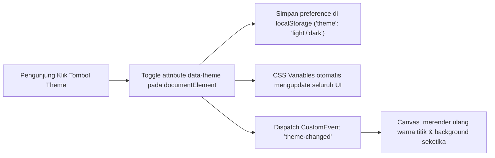

# 🎨 Rancangan Sistem Theme Switcher (Dark & White Mode)

Dokumen ini berisi spesifikasi teknis dan desain implementasi tombol pengubah tema (**Dark Mode 🌙** dan **White/Light Mode ☀️**) untuk website sekolah SMKN 1 Nusantara.

---

## 1. Konsep & Arsitektur Tema

Sistem tema akan menggunakan pendekatan **CSS Custom Properties (Variables)** berbasis atribut `data-theme="dark"` atau `data-theme="light"` pada elemen `<html>`/`<body>`.

* **Default Mode (Dark Mode)**: **TIDAK ADA PERUBAHAN APAPUN**. Seluruh styling, CSS eksisting, warna navy, efek cyan, dan background yang berjalan saat ini tetap utuh 100% sebagai baseline/default.
* **White Mode (Mode Tambahan)**: Hanya diterapkan secara terisolasi melalui selector khusus `[data-theme="light"]` (atau class `.light-mode`) menggunakan palet warna modern berbasis ruang warna **OKLCH**:
  1. Background yang saat ini hitam &rarr; di-override menjadi **Putih (`#ffffff` / `#f8fafc`)**.
  2. Titik-titik animasi partikel (Canvas Constellation) &rarr; di-override menjadi **`oklch(58.6% 0.253 17.585)`** (Vibrant Crimson / Rose Neon).
  3. Background yang saat ini warna Navy &rarr; di-override menjadi **`oklch(41% 0.159 10.272)`** (Deep Burgundy / Wine).
  4. Container / Cards / Kapsul Navbar &rarr; di-override menjadi **`oklch(27.1% 0.105 12.094)`** (Rich Maroon / Dark Wine Container).
  5. Hover Container &rarr; di-override menjadi tone senada **`oklch(33% 0.125 13)`** dengan border glow `oklch(58.6% 0.253 17.585)`.

---

## 2. Pemetaan Palet Warna (Color Tokens)

| Elemen / Token | Dark Mode (Default Saat Ini) | White / Light Mode (Spesifikasi Baru) |
| :--- | :--- | :--- |
| **Page / Content Background** | `#020617` / `#001529` (Hitam / Deep Dark) | `#ffffff` / `#fdfefe` (Putih Bersih) |
| **Navy Background Sections** *(Stats, Sambutan, Hero transition)* | `#002147` / `rgba(0, 33, 71, 0.96)` | `oklch(41% 0.159 10.272)` (Burgundy / Wine) |
| **Container / Card Surface** *(Navbar Capsules, Card Jurusan, Fasilitas, Form)* | `rgba(15, 23, 42, 0.85)` / `#002147` | `oklch(27.1% 0.105 12.094)` (Deep Maroon) |
| **Container Hover State** | `rgba(0, 38, 80, 0.98)` / `#0c1c34` | `oklch(33% 0.125 13)` (Medium Maroon Glow) |
| **Accent / Dots / Borders** | `#00B4D8` / `#38bdf8` (Cyan Neon) | `oklch(58.6% 0.253 17.585)` (Crimson Neon) |
| **Accent Hover / Glow** | `rgba(0, 180, 216, 0.45)` | `oklch(65% 0.26 18 / 0.45)` |
| **Heading Text (White Area)** | `#ffffff` | `#0f172a` (Charcoal Slate) |
| **Subtext / Muted (White Area)** | `#94a3b8` | `#475569` (Dark Slate) |
| **Text di Dalam Container** | `#ffffff` / `#cbd5e1` | `#ffffff` / `#ffe4e6` (Putih & Soft Rose) |

---

## 3. Desain Komponen Tombol Switch (`Theme Switcher Button`)

### A. Lokasi Penempatan
Tombol switch akan ditempatkan di dalam **Kapsul Kanan Navbar (`.navbar-right`)**, berdampingan secara rapi dengan tombol Login dan tombol Menu:
```html
<div class="navbar-capsule navbar-right">
    {{-- Tombol Switch Dark / Light Mode --}}
    <button class="nav-theme-toggle" id="themeToggleBtn" aria-label="Ganti Tema" title="Ganti Tema (Dark / White Mode)">
        <span class="theme-icon-sun">☀️</span>
        <span class="theme-icon-moon">🌙</span>
    </button>

    {{-- Tombol Login / Admin --}}
    <div class="nav-auth-desktop">
        ...
    </div>

    {{-- Tombol Menu Mobile --}}
    <button class="nav-btn-menu" id="navToggle">...</button>
</div>
```

### B. Tampilan & Visual Tombol
* **Bentuk**: Kapsul bulat / icon pill dengan ukuran `38px x 38px`.
* **Efek**: Background glassmorphism transparan dengan border menyesuaikan warna aksen tema yang sedang aktif.
* **Animasi Transisi**: Efek rotasi dan scale halus saat berganti dari ikon Bulan 🌙 ke Matahari ☀️.

---

## 4. Mekanisme State & Sinkronisasi Real-Time



### A. Anti-Flicker Script di `<head>`
Untuk mencegah layar berkedip (*flash of unstyled theme*) saat halaman dimuat ulang, script inline ringan disisipkan di awal file layout:
```javascript
(function() {
    const savedTheme = localStorage.getItem('theme') || 'dark';
    document.documentElement.setAttribute('data-theme', savedTheme);
})();
```

### B. Sinkronisasi Animasi Canvas (`<x-constellation-grid>`)
Canvas animasi kinetik akan mendengarkan perubahan tema secara langsung tanpa harus me-reload halaman:
* Saat **Dark Mode**: Background Canvas `#020617`, titik node berwarna putih / abu-abu terang, dan efek jaring/titik kursor berwarna `#00B4D8`.
* Saat **White Mode**: Background Canvas `#ffffff`, titik node berwarna soft crimson, dan efek jaring/titik kursor berwarna `oklch(58.6% 0.253 17.585)`.

---

## 5. Rencana Modifikasi File (Eksekusi Setelah Persetujuan)

1. **`public/css/style.css`**:
   * Menambahkan selector `[data-theme="light"]` dengan variabel warna OKLCH sesuai instruksi.
   * Menambahkan style untuk komponen `.nav-theme-toggle` (ikon matahari/bulan, hover, dan animasi).
2. **`resources/views/partials/navbar.blade.php`**:
   * Menambahkan elemen tombol switch di kapsul kanan navbar.
   * Menambahkan script handler klik untuk toggle theme dan persist ke `localStorage`.
3. **`resources/views/layouts/app.blade.php`**:
   * Menambahkan inline script pencegah flicker tema di tag `<head>`.
4. **`resources/views/components/constellation-grid.blade.php`**:
   * Mengintegrasikan deteksi `data-theme` dan event listener `theme-changed` ke dalam loop animasi canvas `render()`.
5. **`resources/views/welcome.blade.php`**:
   * Penyesuaian kontras teks agar terbaca sempurna di kedua mode.

---
