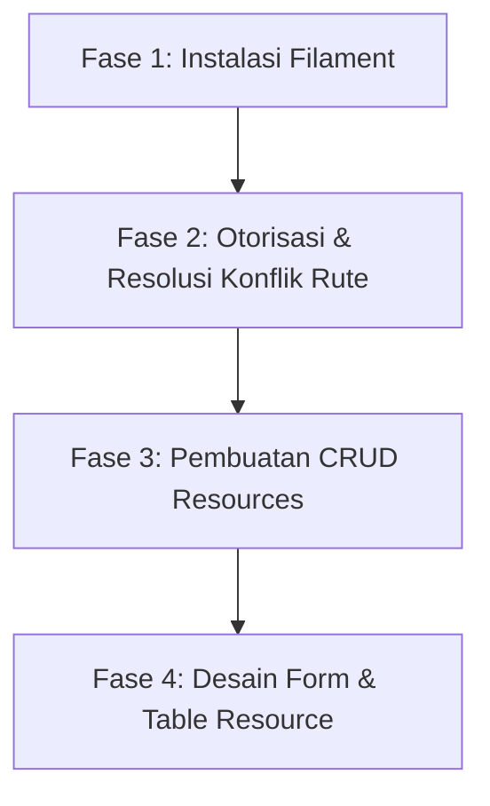

# ⚡ Panduan Lengkap: Integrasi Filament Admin Panel v3

Dokumen ini berisi panduan rancangan dan langkah-langkah implementasi **Filament v3** (admin panel instan berbasis Livewire & Tailwind CSS) pada website **Attamam Edu**.

Filament akan mempermudah tim pengembang dalam membuat sistem CRUD (Create, Read, Update, Delete) yang lengkap dan aman untuk modul Berita, Jurusan, Guru, dan PPDB tanpa perlu menulis controller atau HTML view manual.

---

## 📅 Peta Langkah Pengerjaan



---

## 🚀 FASE 1: Instalasi Filament Panels v3

Filament v3 memerlukan Tailwind CSS dan Livewire yang akan dipasang otomatis saat instalasi.

### Langkah 1: Pasang Filament via Composer
Jalankan perintah berikut di terminal Anda:
```bash
composer require filament/filament:"^3.2" -W
```

### Langkah 2: Buat Panel Admin Default
Jalankan perintah artisan untuk menggenerasi Provider Panel Admin:
```bash
php artisan filament:install --panels
```
*Hasil:*
* Membuat file konfigurasi panel: `app/Providers/Filament/AdminPanelProvider.php`.
* Mendaftarkan provider baru tersebut ke dalam `bootstrap/providers.php` (khas Laravel 11).

---

## 🚀 FASE 2: Otorisasi & Resolusi Konflik Rute

### Langkah 1: Resolusi Konflik Rute `/admin`
Secara default, Filament menempati rute `/admin`. Namun, di project kita rute `/admin` sudah dipakai untuk route group manual di [`routes/web.php`](file:///D:/Website%20Attamam%20Edu/AttamamEdu/routes/web.php).

Ada 2 pilihan solusi:
1. **Pilihan A (Side-by-Side):** Ubah rute Filament menjadi `/portal` atau `/office` agar rute lama Anda tetap berfungsi.
2. **Pilihan B (Gantikan Rute Lama):** Biarkan rute Filament di `/admin`, tapi hapus atau beri komentar pada rute admin lama di [`routes/web.php`](file:///D:/Website%20Attamam%20Edu/AttamamEdu/routes/web.php).

Jika Anda memilih **Pilihan A**, buka `app/Providers/Filament/AdminPanelProvider.php` dan ubah method `path()`:
```diff
     public function panel(Panel $panel): Panel
     {
         return $panel
             ->default()
             ->id('admin')
-            ->path('admin')
+            ->path('portal') // 👈 Ubah URL akses menjadi http://127.0.0.1:8000/portal
             ->login()
```

---

### Langkah 2: Batasi Akses Panel Berdasarkan `role` & `is_active`
Agar hanya pengguna berwenang yang aktif yang dapat mengakses panel Filament, kita harus mengimplementasikan kontrak `FilamentUser` pada model `User`.

Buka file [`app/Models/User.php`](file:///D:/Website%20Attamam%20Edu/AttamamEdu/app/Models/User.php) dan edit seperti ini:

```php
<?php

namespace App\Models;

use Filament\Models\Contracts\FilamentUser; // 👈 1. Import interface ini
use Filament\Panel;
use Illuminate\Foundation\Auth\User as Authenticatable;
use Illuminate\Notifications\Notifiable;

class User extends Authenticatable implements FilamentUser // 👈 2. Implementasikan
{
    use Notifiable;

    // ... kolom fillable & hidden bawaan ...

    /**
     * 👈 3. Tambahkan method ini untuk validasi masuk panel
     */
    public function canAccessPanel(Panel $panel): bool
    {
        // Hanya izinkan user yang aktif dan memiliki role di bawah ini
        return $this->is_active && in_array($this->role, [
            'super_admin', 
            'admin_cms', 
            'admin_ppdb', 
            'editor_akademik'
        ]);
    }
}
```

---

## 🚀 FASE 3: Pembuatan CRUD Resources

Filament menggunakan konsep **Resource** untuk mengotomatisasi halaman CRUD suatu model.

Jalankan perintah berikut di terminal untuk membuat halaman manajemen otomatis:

```bash
# 1. Halaman Manajemen Jurusan (Majors)
php artisan make:filament-resource Major

# 2. Halaman Manajemen Berita (News)
php artisan make:filament-resource News

# 3. Halaman Manajemen Guru & Staf (TeacherStaff)
php artisan make:filament-resource TeacherStaff

# 4. Halaman Manajemen PPDB (PpdbRegistration)
php artisan make:filament-resource PpdbRegistration
```
*Hasil:* Direktori baru akan dibuat di `app/Filament/Resources/`. Setiap folder berisi file konfigurasi form input, tabel, dan halaman edit/create.

---

## 🚀 FASE 4: Kustomisasi Form & Table Resource

Buka file resource untuk merancang form input dan kolom tabel yang akan ditampilkan.

### Contoh Kustomisasi: `MajorResource.php`
Buka file `app/Filament/Resources/MajorResource.php`, kita dapat menyusun form dan tabel menggunakan komponen bawaan Filament:

```php
// app/Filament/Resources/MajorResource.php

use Filament\Forms\Components\TextInput;
use Filament\Forms\Components\Textarea;
use Filament\Tables\Columns\TextColumn;

public static function form(Form $form): Form
{
    return $form
        ->schema([
            TextInput::make('name')
                ->required()
                ->maxLength(255)
                ->label('Nama Jurusan'),
            TextInput::make('slug')
                ->required()
                ->unique(ignoreRecord: true)
                ->maxLength(255),
            Textarea::make('description')
                ->label('Deskripsi Jurusan')
                ->rows(4),
            TextInput::make('icon')
                ->maxLength(10)
                ->placeholder('Contoh: ⚡ atau 🎨')
                ->label('Simbol/Emoji Icon'),
        ]);
}

public static function table(Table $table): Table
{
    return $table
        ->columns([
            TextColumn::make('icon')->label('Icon'),
            TextColumn::make('name')->searchable()->sortable()->label('Nama Jurusan'),
            TextColumn::make('slug'),
            TextColumn::make('created_at')
                ->dateTime()
                ->sortable()
                ->toggleable(isToggledHiddenByDefault: true),
        ])
        ->filters([
            //
        ]);
}
```

### Contoh Kustomisasi: `PpdbRegistrationResource.php`
Buka file `app/Filament/Resources/PpdbRegistrationResource.php` untuk memverifikasi pendaftaran PPDB:

```php
// app/Filament/Resources/PpdbRegistrationResource.php

use Filament\Forms\Components\Select;
use Filament\Forms\Components\TextInput;
use Filament\Tables\Columns\SelectColumn;
use Filament\Tables\Columns\TextColumn;

public static function form(Form $form): Form
{
    return $form
        ->schema([
            TextInput::make('no_pendaftaran')->disabled(),
            TextInput::make('full_name')->required(),
            Select::make('status')
                ->options([
                    'pending' => 'Pending',
                    'diverifikasi' => 'Diverifikasi',
                    'diterima' => 'Diterima',
                    'ditolak' => 'Ditolak',
                ])
                ->required(),
        ]);
}

public static function table(Table $table): Table
{
    return $table
        ->columns([
            TextColumn::make('no_pendaftaran')->searchable()->sortable(),
            TextColumn::make('full_name')->searchable()->sortable(),
            TextColumn::make('major_choice')->label('Pilihan Jurusan'),
            // Memungkinkan admin mengubah status langsung dari tabel index!
            SelectColumn::make('status')
                ->options([
                    'pending' => 'Pending',
                    'diverifikasi' => 'Diverifikasi',
                    'diterima' => 'Diterima',
                    'ditolak' => 'Ditolak',
                ])
                ->sortable(),
        ]);
}
```

---

## 🏃 FASE 5: Uji Coba

1. Pastikan server lokal aktif (`php artisan serve`).
2. Akses halaman panel melalui browser di alamat:
   * **`http://127.0.0.1:8000/portal`** (Jika memilih Pilihan A).
   * **`http://127.0.0.1:8000/admin`** (Jika memilih Pilihan B).
3. Login menggunakan akun Super Admin yang di-seed sebelumnya:
   * **Email:** `budi.guru@sekolah.sch.id`
   * **Password:** `password123`
4. Coba kelola data Jurusan atau verifikasi data PPDB. Perubahan akan langsung tersimpan di database MySQL Anda!
