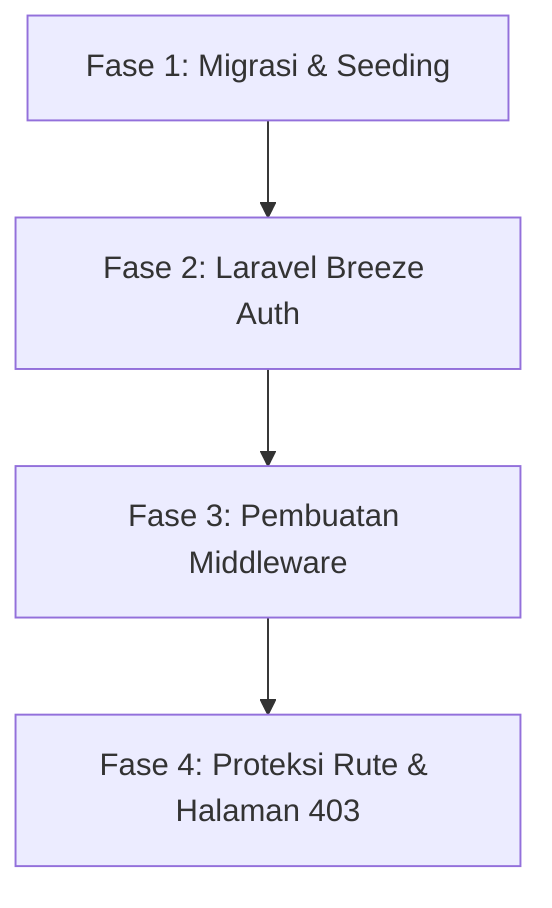

# 🗺️ Panduan Lengkap: Integrasi Autentikasi Breeze & Middleware Multi-Role (RBAC)

Dokumen ini menggabungkan seluruh langkah instalasi **Laravel Breeze** dan pembuatan **Middleware Otorisasi (RBAC)** ke dalam satu urutan pengerjaan yang logis, sistematis, dan siap dipraktikkan secara mandiri untuk project **Attamam Edu**.

---

## 📅 Peta Urutan Pengerjaan (Roadmap)



---

## 📁 File-File yang Akan Diedit/Dibuat
* [`bootstrap/app.php`](file:///D:/Website%20Attamam%20Edu/AttamamEdu/bootstrap/app.php) *(Registrasi Middleware)*
* [`routes/web.php`](file:///D:/Website%20Attamam%20Edu/AttamamEdu/routes/web.php) *(Konfigurasi Rute Admin)*
* `app/Http/Controllers/Auth/RegisteredUserController.php` *(Kustomisasi Registrasi)*
* `app/Http/Controllers/Auth/AuthenticatedSessionController.php` *(Kustomisasi Login)*
* `app/Http/Middleware/RoleMiddleware.php` *(Middleware Peran)*
* `app/Http/Middleware/EnsureUserIsActive.php` *(Middleware Status Aktif)*
* `resources/views/errors/403.blade.php` *(Tampilan Akses Ditolak)*

---

## 🚀 FASE 1: Migrasi & Seeding Database

Pastikan server MySQL Anda (XAMPP / Laragon) aktif, lalu jalankan perintah berikut untuk mereset database dan mengisinya dengan akun admin pembimbing serta data dummy:

```bash
php artisan migrate:fresh --seed
```
*Hasil: Akun Super Admin default dibuat dengan email `budi.guru@sekolah.sch.id` dan password `password123`.*

---

## 🚀 FASE 2: Instalasi & Kustomisasi Laravel Breeze

Breeze akan menangani proses pendaftaran dan masuk sistem.

### Langkah 1: Unduh Laravel Breeze via Composer
```bash
composer require laravel/breeze --dev
```

### Langkah 2: Jalankan Pemasangan Breeze (Pilih Blade)
```bash
php artisan breeze:install blade
```
* **Dark mode?** Pilih `no`.
* **Testing framework?** Pilih `PHPUnit` (default).

### Langkah 3: Install & Build Aset Frontend
```bash
npm install
npm run build
```

### Langkah 4: Kustomisasi Register (Set Default Role)
Buka file `app/Http/Controllers/Auth/RegisteredUserController.php` dan edit method `store` untuk menambahkan role default:

```php
// app/Http/Controllers/Auth/RegisteredUserController.php
public function store(Request $request): RedirectResponse
{
    $request->validate([
        'name' => ['required', 'string', 'max:255'],
        'email' => ['required', 'string', 'lowercase', 'email', 'max:255', 'unique:'.User::class],
        'password' => ['required', 'confirmed', Rules\Password::defaults()],
    ]);

    $user = User::create([
        'name' => $request->name,
        'email' => $request->email,
        'password' => Hash::make($request->password),
        'role' => 'editor_akademik', // 👈 Tambahkan baris ini
        'is_active' => true,         // 👈 Tambahkan baris ini
    ]);

    event(new Registered($user));
    Auth::login($user);

    return redirect(route('admin.dashboard', absolute: false)); // 👈 Ubah tujuan redirect
}
```

### Langkah 5: Kustomisasi Login (Ubah Redirect Halaman Utama)
Buka file `app/Http/Controllers/Auth/AuthenticatedSessionController.php` dan sesuaikan tujuan redirect method `store`:

```php
// app/Http/Controllers/Auth/AuthenticatedSessionController.php
public function store(LoginRequest $request): RedirectResponse
{
    $request->authenticate();
    $request->session()->regenerate();

    // 👈 Arahkan langsung ke dashboard admin
    return redirect()->intended(route('admin.dashboard', absolute: false));
}
```

---

## 🚀 FASE 3: Pembuatan & Registrasi Middleware

Kita akan membuat filter keamanan untuk memeriksa apakah akun user aktif dan apakah role-nya cocok.

### Langkah 1: Generate Middleware Baru
Jalankan di terminal Anda:
```bash
php artisan make:middleware RoleMiddleware
php artisan make:middleware EnsureUserIsActive
```

### Langkah 2: Isi Logika `RoleMiddleware`
Buka file `app/Http/Middleware/RoleMiddleware.php` dan masukkan logika pemeriksaan role:

```php
<?php

namespace App\Http\Middleware;

use Closure;
use Illuminate\Http\Request;
use Symfony\Component\HttpFoundation\Response;

class RoleMiddleware
{
    public function handle(Request $request, Closure $next, ...$roles): Response
    {
        // 1. Cek Login
        if (!$request->user()) {
            return redirect()->route('login');
        }

        // 2. Cek Role
        if (!in_array($request->user()->role, $roles)) {
            abort(403, 'Akses ditolak.');
        }

        return $next($request);
    }
}
```

### Langkah 3: Isi Logika `EnsureUserIsActive`
Buka file `app/Http/Middleware/EnsureUserIsActive.php` dan masukkan logika untuk memblokir akun yang dinonaktifkan:

```php
<?php

namespace App\Http\Middleware;

use Closure;
use Illuminate\Http\Request;
use Symfony\Component\HttpFoundation\Response;
use Illuminate\Support\Facades\Auth;

class EnsureUserIsActive
{
    public function handle(Request $request, Closure $next): Response
    {
        if ($request->user() && !$request->user()->is_active) {
            Auth::logout();
            $request->session()->invalidate();
            $request->session()->regenerateToken();

            return redirect()->route('login')
                ->with('error', 'Akun Anda dinonaktifkan. Silakan hubungi Guru Pembimbing.');
        }

        return $next($request);
    }
}
```

### Langkah 4: Registrasi Middleware di Laravel 11
Buka file [`bootstrap/app.php`](file:///D:/Website%20Attamam%20Edu/AttamamEdu/bootstrap/app.php) dan tambahkan alias middleware:

```php
    ->withMiddleware(function (Middleware $middleware): void {
        $middleware->alias([
            'role' => \App\Http\Middleware\RoleMiddleware::class,
            'active' => \App\Http\Middleware\EnsureUserIsActive::class,
        ]);
    })
```

---

## 🚀 FASE 4: Proteksi Rute & Halaman 403

### Langkah 1: Update Rute di [`routes/web.php`](file:///D:/Website%20Attamam%20Edu/AttamamEdu/routes/web.php)
Hapus rute login simulasi (jika masih ada) dan bungkus semua rute `/admin` menggunakan Middleware Group:

```php
// routes/web.php

// Rute Publik
Route::get('/', [SchoolController::class, 'index'])->name('home');
Route::post('/kontak', [SchoolController::class, 'submitContact'])->name('kontak.submit');

// Rute Autentikasi dari Breeze
require __DIR__.'/auth.php';

// Rute Admin dengan Middleware Proteksi
Route::middleware(['auth', 'active'])->prefix('admin')->name('admin.')->group(function () {
    
    // Semua yang login & aktif bisa masuk dashboard
    Route::get('/dashboard', [AdminController::class, 'dashboard'])->name('dashboard');

    // Modul Berita & Galeri (Super Admin & Admin CMS)
    Route::middleware(['role:super_admin,admin_cms'])->group(function () {
        Route::get('/news', [AdminController::class, 'newsIndex'])->name('news.index');
        Route::get('/news/create', [AdminController::class, 'newsCreate'])->name('news.create');
        Route::post('/news', [AdminController::class, 'newsStore'])->name('news.store');
        Route::get('/news/{id}/edit', [AdminController::class, 'newsEdit'])->name('news.edit');
        Route::post('/news/{id}', [AdminController::class, 'newsUpdate'])->name('news.update');
        Route::delete('/news/{id}', [AdminController::class, 'newsDelete'])->name('news.delete');
    });

    // Modul Akademik (Super Admin, Admin CMS, & Editor Akademik)
    Route::middleware(['role:super_admin,admin_cms,editor_akademik'])->group(function () {
        Route::get('/teachers', [AdminController::class, 'teacherIndex'])->name('teachers.index');
        Route::get('/teachers/create', [AdminController::class, 'teacherCreate'])->name('teachers.create');
        Route::post('/teachers', [AdminController::class, 'teacherStore'])->name('teachers.store');
        Route::get('/teachers/{id}/edit', [AdminController::class, 'teacherEdit'])->name('teachers.edit');
        Route::post('/teachers/{id}', [AdminController::class, 'teacherUpdate'])->name('teachers.update');
        Route::delete('/teachers/{id}', [AdminController::class, 'teacherDelete'])->name('teachers.delete');

        Route::get('/majors', [AdminController::class, 'majorIndex'])->name('majors.index');
        Route::get('/majors/create', [AdminController::class, 'majorCreate'])->name('majors.create');
        Route::post('/majors', [AdminController::class, 'majorStore'])->name('majors.store');
        Route::get('/majors/{id}/edit', [AdminController::class, 'majorEdit'])->name('majors.edit');
        Route::post('/majors/{id}', [AdminController::class, 'majorUpdate'])->name('majors.update');
        Route::delete('/majors/{id}', [AdminController::class, 'majorDelete'])->name('majors.delete');
    });

    // Modul PPDB (Super Admin & Admin PPDB)
    Route::middleware(['role:super_admin,admin_ppdb'])->group(function () {
        Route::get('/ppdb', [AdminController::class, 'ppdbIndex'])->name('ppdb.index');
        Route::get('/ppdb/{id}', [AdminController::class, 'ppdbShow'])->name('ppdb.show');
        Route::post('/ppdb/{id}/status', [AdminController::class, 'ppdbUpdateStatus'])->name('ppdb.status');
        Route::delete('/ppdb/{id}', [AdminController::class, 'ppdbDelete'])->name('ppdb.delete');
    });
});
```

### Langkah 2: Buat Halaman Error 403
Buat file di `resources/views/errors/403.blade.php`:

```html
<!DOCTYPE html>
<html lang="id">
<head>
    <meta charset="UTF-8">
    <meta name="viewport" content="width=device-width, initial-scale=1.0">
    <title>Akses Ditolak - 403</title>
    <link href="https://fonts.googleapis.com/css2?family=Plus+Jakarta+Sans:wght@400;700&display=swap" rel="stylesheet">
    <style>
        body { font-family: 'Plus Jakarta Sans', sans-serif; background: #f8fafc; color: #1e293b; display: flex; align-items: center; justify-content: center; height: 100vh; margin: 0; text-align: center; }
        .container { max-width: 500px; padding: 2rem; background: white; border-radius: 12px; box-shadow: 0 4px 6px -1px rgb(0 0 0 / 0.1); }
        h1 { font-size: 4rem; margin: 0; color: #ef4444; }
        h2 { font-size: 1.5rem; margin-top: 0.5rem; }
        p { color: #64748b; line-height: 1.6; margin-bottom: 2rem; }
        .btn { background: #2563eb; color: white; padding: 10px 20px; text-decoration: none; border-radius: 6px; font-weight: bold; }
    </style>
</head>
<body>
    <div class="container">
        <h1>403</h1>
        <h2>Akses Ditolak!</h2>
        <p>Anda tidak diizinkan mengakses halaman ini. Hubungi pembimbing jika ini merupakan kesalahan.</p>
        <a href="{{ route('admin.dashboard') }}" class="btn">Kembali ke Dashboard</a>
    </div>
</body>
</html>
```

---

## 🔒 FASE 5: Nonaktifkan Registrasi Publik (Produksi)
Agar tidak sembarang orang bisa mendaftar sebagai admin sekolah, buka `routes/auth.php` yang dihasilkan oleh Breeze, lalu beri komentar atau hapus bagian berikut:

```php
// routes/auth.php

// Route::get('register', [RegisteredUserController::class, 'create'])->name('register');
// Route::post('register', [RegisteredUserController::class, 'store']);
```
Dengan ini, pembuatan akun admin baru hanya bisa dilakukan oleh Super Admin melalui database atau seeder.
