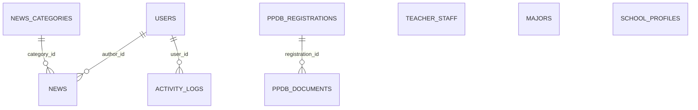

# 📑 REKAPITULASI PEMBELAJARAN & IMPLEMENTASI PROYEK LARAVEL 11 & FILAMENT v3
## 🏫 Sistem Informasi & Website Profil Attamam Edu (PKBM Tahfizh At-Tamam)

---

## 📌 1. Gambaran Umum Proyek (Project Overview)

Proyek **Attamam Edu** adalah platform sistem informasi dan website profil berbasis web modern untuk institusi pendidikan. Platform ini memadukan **portal publik/landing page interaktif** untuk calon siswa dan wali murid, dengan **sistem administrasi terpadu (dual panel: Custom Controller & Filament Admin Panels v3)** untuk pengelola sekolah.

### 🛠️ Tech Stack & Ekosistem Teknologi
* **Backend Framework:** Laravel 11.x (PHP 8.2+)
* **Admin Panel Engine:** Filament Panels v3.x (Livewire 3, Alpine.js, Tailwind CSS)
* **Frontend Web:** Blade Templating, Custom Responsive CSS & Tailwind CSS, Vite
* **Database Engine:** MySQL 8.x (didukung Eloquent ORM)
* **Autentikasi & RBAC:** Multi-guard & Multi-Role (`super_admin`, `admin_cms`, `admin_ppdb`, `editor_akademik`)
* **Penyimpanan Berkas:** Laravel Public Storage Disk & Symlink

```mermaid
graph TD
    User[Pengunjung / Calon Siswa] -->|Akses Publik| Landing[Landing Page (Blade + SchoolController)]
    User -->|Formulir PPDB / Kontak| Submit[Validasi & Simpan ke DB MySQL]
    
    Admin[Admin / Guru / Panitia PPDB] -->|Login Rute /admin| CustomAdmin[Dashboard Admin Blade (AdminController)]
    Admin -->|Login Rute /portal| FilamentPanel[Filament Admin Panel v3 (Resources)]
    
    Submit --> DB[(Database MySQL)]
    CustomAdmin --> DB
    FilamentPanel --> DB
    Submit --> Log[Catat Activity Log]
```

---

## 🧱 2. Arsitektur & Struktur Direktori Proyek

Laravel 11 mengadopsi struktur *lean* (ramping), di mana konfigurasi middleware, routing, dan exception dipusatkan di [`bootstrap/app.php`](file:///D:/Website%20Attamam%20Edu/AttamamEdu/bootstrap/app.php) tanpa membutuhkan file `Kernel.php` tradisional.

```text
AttamamEdu/
├── app/
│   ├── Filament/
│   │   └── Resources/
│   │       ├── Majors/               # Resource CRUD Jurusan / Program Keahlian
│   │       ├── News/                 # Resource CMS Berita & Artikel
│   │       ├── PpdbRegistrations/    # Resource Verifikasi Siswa & Dokumen PPDB
│   │       └── TeacherStaff/         # Resource Manajemen Data Guru & Staf
│   ├── Http/
│   │   ├── Controllers/
│   │   │   ├── AdminController.php   # Controller Dashboard & CRUD Manual Admin
│   │   │   └── SchoolController.php  # Controller Landing Page & Submit Kontak PPDB
│   │   └── Middleware/
│   │       ├── EnsureUserIsActive.php # Validasi status aktif pengguna
│   │       └── RoleMiddleware.php     # Validasi role pengguna (RBAC)
│   ├── Models/                       # Model Eloquent (User, News, Major, TeacherStaff, dll)
│   └── Providers/
│       └── Filament/
│           └── AdminPanelProvider.php # Konfigurasi Panel Filament (Path /portal)
├── database/
│   ├── migrations/                   # Skema struktur tabel database berelasi
│   └── seeders/
│       └── DatabaseSeeder.php        # Data awal idempoten (admin, jurusan, berita, guru, ppdb)
├── resources/
│   └── views/
│       ├── admin/                    # Tampilan Blade Dashboard & Manajemen Data Admin
│       ├── components/               # Blade Components Reusable (<x-card>, <x-stat-card>, dll)
│       ├── layouts/                  # Master Layout (app.blade.php, admin.blade.php)
│       ├── partials/                 # Komponen Partial (navbar, footer)
│       └── welcome.blade.php         # Halaman Utama Landing Page
└── routes/
    └── web.php                       # Definisi seluruh rute publik & rute admin
```

---

## 📚 3. Rangkuman Materi Pembelajaran & Penerapannya

---

### 🚀 MODUL A: Dasar Laravel 11, Routing, Controller & Blade Templating

Materi ini berfokus pada fondasi web Laravel, pemisahan antarmuka secara modular, dan pemrosesan formulir publik.

#### 1. Routing Terstruktur ([`routes/web.php`](file:///D:/Website%20Attamam%20Edu/AttamamEdu/routes/web.php))
* Menggunakan **Named Routes** (`->name('home')`, `->name('kontak.submit')`) untuk mempermudah pemanggilan URL dinamis dengan helper `route()`.
* **Route Redirection:** Mengarahkan rute `/login` langsung ke panel login Filament di `/portal/login`.
* **Route Grouping & Prefix:** Mengelompokkan rute pengelolaan admin di bawah middleware `auth` dan prefix `admin/`.

#### 2. Master Layout & Modular Blade View
* **Don't Repeat Yourself (DRY):** Memisahkan layout master ([`resources/views/layouts/app.blade.php`](file:///D:/Website%20Attamam%20Edu/AttamamEdu/resources/views/layouts/app.blade.php)) dari bagian navigasi ([`resources/views/partials/navbar.blade.php`](file:///D:/Website%20Attamam%20Edu/AttamamEdu/resources/views/partials/navbar.blade.php)) dan kaki halaman ([`resources/views/partials/footer.blade.php`](file:///D:/Website%20Attamam%20Edu/AttamamEdu/resources/views/partials/footer.blade.php)).
* **Direktif Blade Utama:**
  * `@extends('layouts.app')`: Mewarisi struktur master layout.
  * `@yield('konten_utama')` & `@section('konten_utama')`: Titik injeksi konten dinamis halaman anak.
  * `@include('partials.navbar')`: Menyisipkan partial view statis/modular.
  * `@csrf`: Token keamanan wajib pada form HTTP POST untuk menangkal serangan Cross-Site Request Forgery.
  * `@if(session('success'))`: Menangkap pesan notifikasi satu kali (*flash message*).

#### 3. Anonymous Blade Components Reusable
Komponen UI dibuat modular di direktori `resources/views/components/`:
* `<x-card :title="$item['nama']" :badge="$item['badge']" :icon="$item['icon']">`: Kartu informasi jurusan.
* `<x-stat-card :label="$s['label']" :value="$s['value']" :icon="$s['icon']">`: Menampilkan angka statistik sekolah.
* `<x-section-header tag="Prestasi" title="Berita Terbaru" subtitle="...">`: Standarisasi judul bagian (*section*).
> **Catatan Teknis:** Prefiks tanda titik dua (`:`) pada komponen Blade menandakan bahwa atribut tersebut dievaluasi sebagai ekspresi PHP dinamis, bukan sekadar string teks biasa.

#### 4. Pemrosesan Formulir & Validasi Input ([`SchoolController.php`](file:///D:/Website%20Attamam%20Edu/AttamamEdu/app/Http/Controllers/SchoolController.php))
* Validasi formulir kontak & PPDB cepat menggunakan method `$request->validate()` dengan pesan khusus berbahasa Indonesia:
  ```php
  $validated = $request->validate([
      'nama' => 'required|min:3',
      'email' => 'required|email',
      'jurusan_minat' => 'required',
      'pesan' => 'required|min:10',
      'berkas' => 'nullable|file|mimes:pdf,jpg,jpeg,png|max:2048',
  ], [
      'nama.required' => 'Nama lengkap wajib diisi!',
      'email.email' => 'Format email tidak valid!',
      'berkas.max' => 'Ukuran berkas maksimal 2MB.',
  ]);
  ```
* **Unggah Berkas Publik:** Menggunakan `$request->file('berkas')->store('berkas_ppdb', 'public')` untuk menyimpan dokumen syarat calon siswa.
* **Auto-generated Registration Number:** Menghasilkan kode pendaftaran format `PPDB-YYYYMMDD-XXXX`.
* **Flash Message Feedback:** Mengembalikan response redirect dengan notifikasi sukses: `return redirect()->back()->with('success', '...');`.

---

### 🗄️ MODUL B: Database Migration, Relasi Eloquent ORM & Seeding

Materi ini mencakup arsitektur database relasional, pemodelan data berorientasi objek, pencegahan *query overhead*, dan seeding data yang aman.

#### 1. Skema Database Relasional (Database Schema)



* **Daftar Tabel & Fungsinya:**
  1. `users`: Akun administrator, editor, dan panitia PPDB lengkap dengan kolom `role` (`enum`) dan `is_active` (`boolean`).
  2. `news_categories` & `news`: Pengelompokan dan konten artikel/berita dengan relasi `category_id` (foreign key `nullOnDelete`) dan `author_id` (foreign key `cascadeOnDelete`).
  3. `teacher_staff`: Data guru, NIP, foto, dan posisi jabatan.
  4. `majors`: Data kejuruan, keunggulan, deskripsi, dan ikon program keahlian.
  5. `school_profiles`: Data identitas profil sekolah (visi, misi, akreditasi, sambutan kepala sekolah).
  6. `ppdb_registrations`: Data biodata calon siswa baru beserta pilihan jurusan dan status verifikasi (`pending`, `diverifikasi`, `diterima`, `ditolak`).
  7. `ppdb_documents`: Berkas lampiran calon peserta didik (KK, Rapor, Akta) yang terhubung ke tabel pendaftaran via `registration_id`.
  8. `activity_logs`: Catatan riwayat audit (*audit trail*) untuk keamanan dan pemantauan aktivitas seluruh admin di dalam sistem.

#### 2. Relasi Eloquent ORM pada Model
* **One-to-Many & BelongsTo:**
  * Pada [`app/Models/News.php`](file:///D:/Website%20Attamam%20Edu/AttamamEdu/app/Models/News.php): `category()` mengembalikan `$this->belongsTo(NewsCategory::class)` dan `author()` mengembalikan `$this->belongsTo(User::class, 'author_id')`.
  * Pada [`app/Models/NewsCategory.php`](file:///D:/Website%20Attamam%20Edu/AttamamEdu/app/Models/NewsCategory.php): `news()` mengembalikan `$this->hasMany(News::class, 'category_id')`.
  * Pada [`app/Models/PpdbRegistration.php`](file:///D:/Website%20Attamam%20Edu/AttamamEdu/app/Models/PpdbRegistration.php): `documents()` mengembalikan `$this->hasMany(PpdbDocument::class, 'registration_id')`.

#### 3. Optimasi Kueri: Mengatasi N+1 Problem dengan Eager Loading
* **Masalah:** Jika melakukan pemanggilan relasi di dalam loop Blade tanpa eager loading, aplikasi akan menjalankan $1 + N$ kali kueri ke MySQL.
* **Solusi yang Diimplementasikan:** Menggunakan method `with()` di [`SchoolController.php`](file:///D:/Website%20Attamam%20Edu/AttamamEdu/app/Http/Controllers/SchoolController.php) & [`AdminController.php`](file:///D:/Website%20Attamam%20Edu/AttamamEdu/app/Http/Controllers/AdminController.php):
  ```php
  // Hanya mengeksekusi 2 Query SQL, bukan N+1
  $berita = News::with('category')->latest()->take(3)->get();
  ```

#### 4. Database Seeder Idempoten ([`DatabaseSeeder.php`](file:///D:/Website%20Attamam%20Edu/AttamamEdu/database/seeders/DatabaseSeeder.php))
* Menerapkan `firstOrCreate()` dan `updateOrCreate()` agar perintah `php artisan db:seed` dapat dijalankan berulang kali secara aman tanpa memicu galat duplikasi (*Duplicate Entry Violation*) pada kolom unik seperti `slug`, `email`, atau `nip`.

---

### ⚡ MODUL C: Panel Admin Filament v3 & Kontrol Hak Akses (RBAC)

Materi ini mengintegrasikan panel admin modern berbasis Livewire & Tailwind CSS tanpa perlu membuat halaman CRUD dan controller berulang kali.

#### 1. Konfigurasi Multi-Panel & Path Kustom
* Dikonfigurasi pada [`app/Providers/Filament/AdminPanelProvider.php`](file:///D:/Website%20Attamam%20Edu/AttamamEdu/app/Providers/Filament/AdminPanelProvider.php).
* **Resolusi Konflik Rute:** Mengubah path bawaan Filament dari `/admin` menjadi `/portal` sehingga rute manual admin (`/admin/*`) dan panel Filament (`/portal/*`) dapat berjalan berdampingan tanpa bentrok.
* **Warna Tema:** `Color::Amber`.

#### 2. Otorisasi Akses Panel via Kontrak `FilamentUser`
Pada model [`app/Models/User.php`](file:///D:/Website%20Attamam%20Edu/AttamamEdu/app/Models/User.php), diterapkan kontrak `FilamentUser` untuk memastikan hanya pengguna yang aktif dan memiliki role tertentu yang dapat masuk ke panel Filament:
```php
use Filament\Models\Contracts\FilamentUser;
use Filament\Panel;

class User extends Authenticatable implements FilamentUser
{
    public function canAccessPanel(Panel $panel): bool
    {
        return $this->is_active && in_array($this->role, [
            'super_admin',
            'admin_cms',
            'admin_ppdb',
            'editor_akademik'
        ]);
    }
}
```

#### 3. Arsitektur Filament Resource Modular
Setiap entitas di `app/Filament/Resources/` dipisahkan menjadi komponen terisolasi:
1. **Majors Resource:** Manajemen jurusan, deskripsi, slug otomatis, dan ikon.
2. **News Resource:**
   * Form: `TextInput` judul & slug unik (`->unique(ignoreRecord: true)`), `Select` relasi kategori, `FileUpload` thumbnail gambar, dan `RichEditor` format HTML konten artikel.
3. **TeacherStaff Resource:** Manajemen biodata tenaga pengajar, NIP, mata pelajaran yang diampu, dan status kerja.
4. **PpdbRegistrations Resource:**
   * Form & View data pendaftar beserta dokumen terlampir.
   * **Inline Status Verification (`SelectColumn`):** Memungkinkan petugas panitia PPDB mengubah status pendaftaran (`pending` $\rightarrow$ `diverifikasi` $\rightarrow$ `diterima` / `ditolak`) langsung dari baris tabel data tanpa harus berpindah halaman.

---

### 🛡️ MODUL D: Autentikasi, Keamanan & Middleware Multi-Role

Materi ini menjamin keamanan rute dan aksesibilitas data berdasarkan otoritas akun.

#### 1. Middleware Kustom
* [`RoleMiddleware.php`](file:///D:/Website%20Attamam%20Edu/AttamamEdu/app/Http/Middleware/RoleMiddleware.php): Memvalidasi apakah role pengguna yang sedang login sesuai dengan role yang diizinkan untuk mengakses rute tertentu.
* [`EnsureUserIsActive.php`](file:///D:/Website%20Attamam%20Edu/AttamamEdu/app/Http/Middleware/EnsureUserIsActive.php): Memastikan akun yang dinonaktifkan (`is_active = 0`) otomatis dikeluarkan dari sesi dan dicegah mengakses dashboard.
* Registrasi middleware kustom pada [`bootstrap/app.php`](file:///D:/Website%20Attamam%20Edu/AttamamEdu/bootstrap/app.php).

#### 2. Audit Trail & Activity Log ([`ActivityLog.php`](file:///D:/Website%20Attamam%20Edu/AttamamEdu/app/Models/ActivityLog.php))
* Setiap aksi penting (pendaftaran siswa baru, penambahan berita, atau pembaruan status) tercatat otomatis di tabel `activity_logs` dengan menyimpan ID pengguna, nama modul, jenis tindakan (`create`, `update`, `delete`), serta deskripsi waktu nyata.

---

## 🗺️ 4. Peta Rute & Titik Akses Sistem (Route Cheat Sheet)

| Kategori | Metode | URL Endpoint | Nama Rute | Deskripsi & Target Pengguna |
| :--- | :---: | :--- | :--- | :--- |
| **Publik** | `GET` | `/` | `home` | Halaman Landing Page Utama (Siswa, Wali Murid, Umum) |
| **Publik** | `POST` | `/kontak` | `kontak.submit` | Pemrosesan formulir pesan & pendaftaran kontak cepat |
| **PPDB Online**| `GET` | `/ppdb` | `ppdb.index` | Portal Utama Informasi PPDB, Alur, Syarat & Kuota |
| **PPDB Online**| `GET` | `/ppdb/daftar` | `ppdb.create` | Formulir Pendaftaran Siswa Baru Mandiri & Unggah Berkas |
| **PPDB Online**| `POST` | `/ppdb/daftar` | `ppdb.store` | Pemrosesan Data Calon Siswa & Penyimpanan Dokumen |
| **PPDB Online**| `GET` | `/ppdb/sukses/{no}` | `ppdb.success` | Kartu Bukti Pendaftaran Resmi & Siap Cetak Digital |
| **PPDB Online**| `GET` | `/ppdb/cek-status` | `ppdb.tracking` | Halaman Lacak Status PPDB Online Interaktif |
| **PPDB Online**| `POST` | `/ppdb/cek-status` | `ppdb.check` | Pemrosesan Pencarian & Tampilan Status Verifikasi |
| **Publik** | `GET` | `/login` | `login` | Rute pengalihan ke panel login Filament (`/portal/login`) |
| **Publik** | `GET` | `/logout` | `logout` | Keluar dari sesi login dan kembali ke halaman utama |
| **Filament** | `GET` | `/portal` | `filament.admin.pages.dashboard` | Dashboard Utama Panel Filament Admin v3 |
| **Filament** | `GET` | `/portal/login` | `filament.admin.auth.login` | Form Login Panel Filament Admin v3 |
| **Filament** | `*` | `/portal/news` | - | CRUD Berita via Filament Resource |
| **Filament** | `*` | `/portal/ppdb-registrations` | - | Verifikasi PPDB via Filament Resource |
| **Filament** | `*` | `/portal/teacher-staff` | - | Manajemen Guru via Filament Resource |
| **Filament** | `*` | `/portal/majors` | - | Manajemen Jurusan via Filament Resource |
| **Admin Manual**| `GET` | `/admin/dashboard` | `admin.dashboard` | Dashboard Admin Berbasis Blade Standar |
| **Admin Manual**| `GET/POST`| `/admin/news/*` | `admin.news.*` | CRUD Berita Berbasis Blade & AdminController |
| **Admin Manual**| `GET/POST`| `/admin/teachers/*`| `admin.teachers.*` | CRUD Guru Berbasis Blade & AdminController |
| **Admin Manual**| `GET` | `/admin/ppdb` | `admin.ppdb.index` | Daftar Pendaftar PPDB Berbasis Blade |
| **Admin Manual**| `GET` | `/admin/ppdb/export`| `admin.ppdb.export`| 📥 Unduh Rekap Data Pendaftar PPDB format CSV |
| **Admin Manual**| `GET/POST`| `/admin/ppdb/{id}`| `admin.ppdb.show` | Verifikasi Dokumen & Update Status Pendaftar |
| **Admin Manual**| `GET/POST`| `/admin/majors/*` | `admin.majors.*` | CRUD Jurusan Berbasis Blade & AdminController |

---

## 💻 5. Kumpulan Perintah Artisan & CLI Penting (Cheat Sheet)

### ⚙️ Menjalankan Lingkungan Lokal & Aset
```bash
# Menjalankan server backend Laravel
php artisan serve

# Menjalankan Vite untuk hot-reload aset CSS & JS
npm run dev

# Melakukan kompilasi aset frontend untuk mode produksi
npm run build
```

### 🗄️ Database & Storage Symlink
```bash
# Menjalankan migrasi database
php artisan migrate

# Mereset total database dan menjalankan seluruh seeder idempoten
php artisan migrate:fresh --seed

# Menghubungkan direktori storage/app/public ke folder public/storage agar file upload bisa diakses browser
php artisan storage:link
```

### 📦 Generator Komponen & Resources
```bash
# Membuat Controller baru
php artisan make:controller NamaController

# Membuat Model sekaligus file Migration-nya
php artisan make:model NamaModel -m

# Membuat Filament Resource baru (v3)
php artisan make:filament-resource NamaModel

# Membuat Middleware baru
php artisan make:middleware NamaMiddleware
```

---

## ✅ 6. Matriks Capaian & Ceklist Kompetensi

- [x] **Arsitektur MVC:** Memahami alur Request $\rightarrow$ Route $\rightarrow$ Controller $\rightarrow$ Model/DB $\rightarrow$ View.
- [x] **Blade Mastery:** Mampu menyusun Layout Master, Partials, Direktif Blade, dan Anonymous Blade Components dengan props dinamis.
- [x] **Request Validation:** Mampu memvalidasi input teks, email, dan file upload dengan batas ukuran dan format MIME tertentu.
- [x] **Portal PPDB Mandiri:** Membangun formulir pendaftaran siswa baru, upload dokumen persyaratan (KK, Akta, Foto, Rapor), serta privacy notice UU PDP No. 27/2022.
- [x] **Tracking Status Online:** Menampilkan status verifikasi pendaftar (`Pending`, `Diverifikasi`, `Diterima`, `Ditolak`) secara real-time dengan kartu digital siap cetak.
- [x] **Ekspor Data CSV:** Mengimplementasikan fitur unduh rekap data pendaftar format CSV UTF-8 kompatibel Excel di dashboard admin.
- [x] **Database Relasional:** Mendesain foreign key, cascade delete, dan relasi `One-to-Many` serta `BelongsTo`.
- [x] **Pencegahan N+1:** Mengoptimasi query database menggunakan Eager Loading `with()`.
- [x] **Seeder Idempoten:** Menulis seeder yang aman dieksekusi berkali-kali menggunakan `firstOrCreate()` / `updateOrCreate()`.
- [x] **Filament Panels v3:** Mengonfigurasi Admin Panel Provider, Form Schema, Table Schema, dan Action buttons.
- [x] **Inline Editing:** Mengimplementasikan `SelectColumn` pada Filament untuk verifikasi data cepat.
- [x] **Role-Based Access Control (RBAC):** Membatasi akses login panel via kontrak `FilamentUser` dan middleware `RoleMiddleware`.
- [x] **Audit Trail / Logging:** Mencatat setiap histori aksi CRUD admin ke dalam tabel `activity_logs`.

---
*Dokumen ini dirancang sebagai rekapitulasi komprehensif atas seluruh proses perancangan, pembelajaran, dan implementasi kode pada repositori Attamam Edu.*
