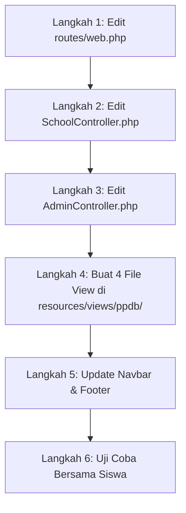

# 👨‍🏫 PANDUAN LIVE CODING BEBAS KONFLIK — UPDATE 1

## 🏫 Modul: Portal PPDB Online Mandiri, Tracking Status & Ekspor Data CSV

### 📌 Studi Kasus: Attamam Edu (PKBM Tahfizh At-Tamam / SMKN 1 Nusantara)

> **Catatan Penting untuk Guru / Tutor:**  
> Dokumen ini dirancang khusus agar sesi _live coding_ bersama siswa berjalan lancar tanpa bentrok (_conflict-free_). Dokumen ini membandingkan **kondisi awal repositori di GitHub** dengan **penambahan kode baru**, dilengkapi panduan sinkronisasi awal dan penanganan error.

---

## 🧭 0. Komparasi Repositori GitHub & Persiapan Awal

Sebelum memulai sesi live coding, pastikan titik awal (_baseline_) antara komputer Guru dan komputer Siswa sudah selaras.

### A. Perbandingan Status Kode (GitHub Baseline vs Update 1)

| Bagian                                | Kondisi di GitHub Sebelumnya                                                              | Penambahan di Update 1 (Live Coding)                                                                                         | Potensi Konflik / Solusi                                                  |
| :------------------------------------ | :---------------------------------------------------------------------------------------- | :--------------------------------------------------------------------------------------------------------------------------- | :------------------------------------------------------------------------ |
| **Routing (`routes/web.php`)**        | Hanya ada rute landing page (`/`), form kontak singkat (`/kontak`), dan rute admin manual | Menambahkan grup rute publik `Route::prefix('ppdb')` dan rute ekspor admin `/admin/ppdb/export`                              | **Aman:** Ditempatkan di antara rute kontak dan rute login                |
| **`SchoolController.php`**            | Hanya ada method `index()` dan `submitContact()`                                          | Menambahkan 6 method PPDB mandiri (`ppdbIndex`, `ppdbCreate`, `ppdbStore`, `ppdbSuccess`, `ppdbTracking`, `ppdbCheckStatus`) | **Aman:** Wajib menambahkan `use App\Models\PpdbDocument;` di bagian atas |
| **`AdminController.php`**             | CRUD PPDB hanya index, show, status, delete                                               | Menambahkan method `ppdbExportCsv()` (streaming response + UTF-8 BOM)                                                        | **Aman:** Ditambahkan tepat setelah method `ppdbIndex()`                  |
| **Views Publik (`resources/views/`)** | Belum ada folder `ppdb/`                                                                  | Membuat folder `resources/views/ppdb/` berisi 4 file Blade                                                                   | **Aman:** File baru, tidak menimpa file lama                              |
| **Database & Model**                  | Tabel `ppdb_registrations` & `ppdb_documents` sudah ada di migration                      | Mengoptimalkan relasi `$registration->documents` dan penyimpanan berkas                                                      | **Aman:** Tidak perlu membuat migration baru                              |

---

### B. Perintah Persiapan Wajib untuk Siswa (Sebelum Live Code Dimulai)

Minta seluruh siswa menjalankan perintah berikut di terminal masing-masing agar environment mereka siap:

```bash
# 1. Pastikan siswa berada di branch main dan mengambil update terakhir
git checkout main
git pull origin main

# 2. Pastikan symlink storage public sudah terhubung (untuk preview berkas upload)
php artisan storage:link

# 3. Segarkan database & seeder data awal
php artisan migrate:fresh --seed

# 4. Jalankan server lokal
php artisan serve
```

---

## 🎯 1. Target Pembelajaran Siswa (Learning Outcomes)

1. **Routing Prefix & Grouping:** Mengelompokkan URL publik modular dengan `Route::prefix('ppdb')->name('ppdb.')->group(...)`.
2. **Relational File Upload:** Menangani unggahan multi-dokumen (KK, Akta, Foto, Rapor) ke tabel terpisah [`ppdb_documents`](file:///D:/Website%20Attamam%20Edu/AttamamEdu/app/Models/PpdbDocument.php) menggunakan relasi Eloquent `One-to-Many`.
3. **Penerapan Regulasi UU PDP No. 27/2022:** Menyisipkan _Privacy Notice_ dan validasi persetujuan keabsahan data anak (`'agreement' => 'accepted'`).
4. **Print-Friendly CSS:** Menggunakan `@media print` untuk membuat kartu bukti registrasi siap cetak tanpa elemen navbar dan footer.
5. **Interactive Status Tracker:** Membuat pelacak status dengan _step progress bar_ visual dan status badge dinamis.
6. **Streaming CSV Export:** Menghasilkan unduhan file CSV kompatibel Microsoft Excel dengan UTF-8 BOM tanpa package pihak ketiga.

---

## 📋 2. Panduan Langkah-demi-Langkah (Live Coding Steps)



---

### 🚀 LANGKAH 1: Memperbarui Rute di `routes/web.php`

Buka file [`routes/web.php`](file:///D:/Website%20Attamam%20Edu/AttamamEdu/routes/web.php).

#### 🔴 Kode Sebelum (Existing di GitHub):

```php
// 1. Route Halaman Utama Landing Page Sekolah
Route::get('/', [SchoolController::class, 'index'])->name('home');

// 2. Route Memproses Form Kontak / Pendaftaran
Route::post('/kontak', [SchoolController::class, 'submitContact'])->name('kontak.submit');

// 3. Route Login Guru (Mengarahkan ke Form Login Panel Admin Filament)
Route::get('/login', function () {
    return redirect('/portal/login');
})->name('login');
```

#### 🟢 Kode Sesudah (Ubah Menjadi):

```php
// 1. Route Halaman Utama Landing Page Sekolah
Route::get('/', [SchoolController::class, 'index'])->name('home');

// 2. Route Memproses Form Kontak Cepat
Route::post('/kontak', [SchoolController::class, 'submitContact'])->name('kontak.submit');

// 3. Route Modul PPDB Online Mandiri (Publik) 👈 [BARU DITAMBAHKAN]
    Route::prefix('ppdb')->name('ppdb.')->group(function () {
        Route::get('/', [SchoolController::class, 'ppdbIndex'])->name('index');
        Route::get('/daftar', [SchoolController::class, 'ppdbCreate'])->name('create');
        Route::post('/daftar', [SchoolController::class, 'ppdbStore'])->name('store');
        Route::get('/sukses/{no_pendaftaran}', [SchoolController::class, 'ppdbSuccess'])->name('success');
        Route::get('/cek-status', [SchoolController::class, 'ppdbTracking'])->name('tracking');
        Route::post('/cek-status', [SchoolController::class, 'ppdbCheckStatus'])->name('check');
    });

    // 4. Route Login Guru (Mengarahkan ke Form Login Panel Admin Filament)
    Route::get('/login', function () {
        return redirect('/portal/login');
    })->name('login');

    // 5. Route Logout Guru
    Route::get('/logout', function () {
        Auth::logout();
        return redirect('/')->with('success', 'Anda telah berhasil Logout dari sistem.');
    })->name('logout');

// 6. Route Group Admin
Route::middleware('auth')->prefix('admin')->name('admin.')->group(function () {
    Route::get('/dashboard', [AdminController::class, 'dashboard'])->name('dashboard');

    // ... Rute News & Teachers ...

    // PPDB Online (PPDB)
    Route::get('/ppdb', [AdminController::class, 'ppdbIndex'])->name('ppdb.index');
    Route::get('/ppdb/export', [AdminController::class, 'ppdbExportCsv'])->name('ppdb.export'); // 👈 [BARU DITAMBAHKAN]
    Route::get('/ppdb/{id}', [AdminController::class, 'ppdbShow'])->name('ppdb.show');
    Route::post('/ppdb/{id}/status', [AdminController::class, 'ppdbUpdateStatus'])->name('ppdb.status');
    Route::delete('/ppdb/{id}', [AdminController::class, 'ppdbDelete'])->name('ppdb.delete');

    // ... Rute Majors ...
});
```

---

### 🚀 LANGKAH 2: Menambahkan Method di `SchoolController.php`

Buka [`app/Http/Controllers/SchoolController.php`](file:///D:/Website%20Attamam%20Edu/AttamamEdu/app/Http/Controllers/SchoolController.php).

#### A. Tambahkan Import Model di Baris Atas:

```php
use App\Models\TeacherStaff;
use App\Models\PpdbRegistration;
use App\Models\PpdbDocument; // 👈 Pastikan di-import
use App\Models\ActivityLog;
```

#### B. Tambahkan 6 Method PPDB Mandiri di Bawah Method `submitContact`:

```php
    /**
     * ========================================================
     * MODUL PPDB MANDIRI PUBLIK (PRD 2.5.3 & SAD 3.5.1)
     * ========================================================
     */

    /**
     * 1. Halaman Informasi Utama PPDB Online
     */
    public function ppdbIndex()
    {
        $majors = Major::all();
        $totalPendaftar = PpdbRegistration::count() + 85;
        $totalDiterima = PpdbRegistration::where('status', 'diterima')->count() + 60;

        $stats = [
            'total' => $totalPendaftar,
            'diterima' => $totalDiterima,
            'gelombang' => 'Gelombang II (Tahun Ajaran 2026/2027)',
            'deadline' => '30 Agustus 2026'
        ];

        return view('ppdb.index', compact('majors', 'stats'));
    }

    /**
     * 2. Formulir Pendaftaran Siswa Baru Mandiri
     */
    public function ppdbCreate()
    {
        $majors = Major::all();
        return view('ppdb.create', compact('majors'));
    }

    /**
     * 3. Memproses Pendaftaran & Upload Dokumen Berkas
     */
    public function ppdbStore(Request $request)
    {
        $validated = $request->validate([
            'full_name' => 'required|string|min:3|max:255',
            'gender' => 'required|in:L,P',
            'birth_date' => 'required|date|before:today',
            'address' => 'required|string|min:8',
            'major_choice' => 'required|string',
            'parent_name' => 'required|string|min:3|max:255',
            'parent_phone' => 'required|string|min:9|max:20',
            'doc_kk' => 'nullable|file|mimes:pdf,jpg,jpeg,png|max:3072',
            'doc_akta' => 'nullable|file|mimes:pdf,jpg,jpeg,png|max:3072',
            'doc_foto' => 'nullable|file|mimes:jpg,jpeg,png|max:3072',
            'doc_rapor' => 'nullable|file|mimes:pdf,jpg,jpeg,png|max:3072',
            'agreement' => 'accepted',
        ], [
            'full_name.required' => 'Nama lengkap calon siswa wajib diisi.',
            'gender.required' => 'Pilih jenis kelamin calon siswa.',
            'birth_date.required' => 'Tanggal lahir wajib diisi.',
            'address.required' => 'Alamat tempat tinggal lengkap wajib diisi.',
            'major_choice.required' => 'Pilih salah satu program keahlian / jurusan.',
            'parent_name.required' => 'Nama orang tua / wali wajib diisi.',
            'parent_phone.required' => 'Nomor WhatsApp / telepon orang tua wajib diisi.',
            'agreement.accepted' => 'Anda wajib menyetujui pernyataan kebenaran data dan kebijakan privasi.',
        ]);

        // Simpan pendaftaran ke database
        $registration = PpdbRegistration::create([
            'full_name' => $validated['full_name'],
            'gender' => $validated['gender'],
            'birth_date' => $validated['birth_date'],
            'address' => $validated['address'],
            'parent_name' => $validated['parent_name'],
            'parent_phone' => $validated['parent_phone'],
            'major_choice' => $validated['major_choice'],
            'status' => 'pending',
            'notes' => 'Pendaftaran online mandiri berhasil diajukan. Menunggu verifikasi berkas oleh panitia PPDB.',
        ]);

        // Upload Dokumen ke tabel ppdb_documents (One-to-Many)
        $docMapping = [
            'doc_kk' => 'kk',
            'doc_akta' => 'akta_lahir',
            'doc_foto' => 'foto',
            'doc_rapor' => 'rapor_terakhir',
        ];

        foreach ($docMapping as $field => $type) {
            if ($request->hasFile($field)) {
                $path = $request->file($field)->store('ppdb_documents', 'public');
                PpdbDocument::create([
                    'registration_id' => $registration->id,
                    'doc_type' => $type,
                    'file_path' => $path,
                    'verification_status' => 'belum_diverifikasi',
                ]);
            }
        }

        // Catat Audit Trail ke tabel activity_logs
        ActivityLog::create([
            'user_id' => null,
            'module' => 'ppdb',
            'action' => 'create',
            'description' => "Pendaftaran PPDB mandiri berhasil diajukan oleh {$registration->full_name} (No: {$registration->no_pendaftaran})",
        ]);

        return redirect()->route('ppdb.success', $registration->no_pendaftaran);
    }

    /**
     * 4. Halaman Sukses Pendaftaran & Kartu Bukti Digital
     */
    public function ppdbSuccess($no_pendaftaran)
    {
        $registration = PpdbRegistration::with('documents')->where('no_pendaftaran', $no_pendaftaran)->firstOrFail();
        return view('ppdb.success', compact('registration'));
    }

    /**
     * 5. Halaman Lacak / Tracking Status PPDB
     */
    public function ppdbTracking()
    {
        return view('ppdb.tracking');
    }

    /**
     * 6. Memproses Pencarian Nomor Pendaftaran
     */
    public function ppdbCheckStatus(Request $request)
    {
        $request->validate([
            'no_pendaftaran' => 'required|string|min:5|max:50',
        ], [
            'no_pendaftaran.required' => 'Masukkan Nomor Pendaftaran yang ingin dicari!',
        ]);

        $query = trim($request->no_pendaftaran);
        $registration = PpdbRegistration::with('documents')
            ->where('no_pendaftaran', $query)
            ->first();

        if (!$registration) {
            return redirect()->route('ppdb.tracking')
                ->withInput()
                ->with('error', "Nomor pendaftaran '{$query}' tidak ditemukan dalam basis data sistem. Pastikan format nomor sudah sesuai.");
        }

        return view('ppdb.tracking', [
            'registration' => $registration,
            'search' => $query,
        ]);
    }
```

---

### 🚀 LANGKAH 3: Menambahkan Ekspor CSV di `AdminController.php`

Buka [`app/Http/Controllers/AdminController.php`](file:///D:/Website%20Attamam%20Edu/AttamamEdu/app/Http/Controllers/AdminController.php). Tambahkan method `ppdbExportCsv()` setelah method `ppdbIndex()`:

```php
    public function ppdbIndex()
    {
        $registrations = PpdbRegistration::orderBy('created_at', 'desc')->get();
        return view('admin.ppdb.index', compact('registrations'));
    }

    /**
     * Ekspor Data PPDB ke format CSV (FR-C06) 👈 [BARU DITAMBAHKAN]
     */
    public function ppdbExportCsv()
    {
        $registrations = PpdbRegistration::orderBy('created_at', 'desc')->get();
        $filename = 'rekap-ppdb-' . date('Y-m-d_His') . '.csv';

        $headers = [
            'Content-Type' => 'text/csv; charset=UTF-8',
            'Content-Disposition' => "attachment; filename=\"{$filename}\"",
            'Pragma' => 'no-cache',
            'Cache-Control' => 'must-revalidate, post-check=0, pre-check=0',
            'Expires' => '0',
        ];

        $callback = function () use ($registrations) {
            $file = fopen('php://output', 'w');

            // Tambahkan UTF-8 BOM untuk kompatibilitas Microsoft Excel
            fprintf($file, chr(0xEF).chr(0xBB).chr(0xBF));

            // Header Kolom CSV
            fputcsv($file, [
                'No. Pendaftaran',
                'Nama Lengkap',
                'Jenis Kelamin',
                'Tanggal Lahir',
                'Alamat',
                'Nama Orang Tua / Wali',
                'No. HP Orang Tua',
                'Pilihan Jurusan',
                'Status Pendaftaran',
                'Catatan Panitia',
                'Tanggal Mendaftar'
            ], ';');

            // Data Baris
            foreach ($registrations as $reg) {
                fputcsv($file, [
                    $reg->no_pendaftaran,
                    $reg->full_name,
                    $reg->gender == 'L' ? 'Laki-laki' : 'Perempuan',
                    $reg->birth_date ? $reg->birth_date->format('d/m/Y') : '-',
                    $reg->address,
                    $reg->parent_name,
                    $reg->parent_phone,
                    strtoupper($reg->major_choice),
                    ucfirst($reg->status),
                    $reg->notes ?? '-',
                    $reg->created_at ? $reg->created_at->format('d/m/Y H:i') : '-',
                ], ';');
            }

            fclose($file);
        };

        $this->logActivity('ppdb', 'export', 'Mengekspor seluruh rekap data pendaftar PPDB ke format file CSV');

        return response()->stream($callback, 200, $headers);
    }
```

---

### 🚀 LANGKAH 4: Membuat 4 File Tampilan Blade di `resources/views/ppdb/`

Pastikan membuat folder `resources/views/ppdb/` terlebih dahulu, kemudian buat 4 file berikut:

1. [`resources/views/ppdb/index.blade.php`](file:///D:/Website%20Attamam%20Edu/AttamamEdu/resources/views/ppdb/index.blade.php): Halaman Portal PPDB (Alur 4 Langkah, Kuota, & Syarat Berkas).
2. [`resources/views/ppdb/create.blade.php`](file:///D:/Website%20Attamam%20Edu/AttamamEdu/resources/views/ppdb/create.blade.php): Formulir Pendaftaran Siswa Baru + Multi Upload Berkas + Checkbox Privacy Notice UU PDP No. 27/2022.
3. [`resources/views/ppdb/success.blade.php`](file:///D:/Website%20Attamam%20Edu/AttamamEdu/resources/views/ppdb/success.blade.php): Kartu Bukti Registrasi Digital dengan fitur tombol Cetak Print-Friendly (`window.print()`).
4. [`resources/views/ppdb/tracking.blade.php`](file:///D:/Website%20Attamam%20Edu/AttamamEdu/resources/views/ppdb/tracking.blade.php): Halaman Lacak Status Seleksi Siswa dengan _Visual Step Progress Bar_.

---

### 🚀 LANGKAH 5: Memperbarui Navigasi & Tampilan Admin

#### A. Navbar ([`resources/views/partials/navbar.blade.php`](file:///D:/Website%20Attamam%20Edu/AttamamEdu/resources/views/partials/navbar.blade.php))

Ubah list navigasi menjadi:

```html
<ul class="nav-links">
    <li><a href="{{ route('home') }}" class="nav-link">Beranda</a></li>
    <li><a href="{{ route('home') }}#jurusan" class="nav-link">Jurusan</a></li>
    <li>
        <a href="{{ route('home') }}#fasilitas" class="nav-link">Fasilitas</a>
    </li>
    <li><a href="{{ route('home') }}#berita" class="nav-link">Berita</a></li>
    <li>
        <a
            href="{{ route('ppdb.index') }}"
            class="nav-link"
            style="color: #60a5fa; font-weight: 700;"
            >🎓 PPDB Online</a
        >
    </li>
    <li>
        <a
            href="{{ route('ppdb.tracking') }}"
            class="nav-link"
            style="color: #fde047; font-weight: 600;"
            >🔍 Cek Status</a
        >
    </li>
</ul>
```

#### B. Header Admin PPDB ([`resources/views/admin/ppdb/index.blade.php`](file:///D:/Website%20Attamam%20Edu/AttamamEdu/resources/views/admin/ppdb/index.blade.php))

Tambahkan tombol ekspor CSV pada tag `<div class="header">`:

```html
<div
    class="header"
    style="display: flex; justify-content: space-between; align-items: center; margin-bottom: 24px;"
>
    <div>
        <h1 class="header-title">Pendaftaran PPDB Online</h1>
        <p
            style="color: var(--text-muted); font-size: 0.9rem; margin-top: 4px;"
        >
            Kelola dan verifikasi pendaftaran calon peserta didik baru.
        </p>
    </div>
    <div>
        <a
            href="{{ route('admin.ppdb.export') }}"
            class="btn btn-success"
            style="display: inline-flex; align-items: center; gap: 8px; font-weight: 600; padding: 10px 18px; border-radius: 8px; text-decoration: none; color: white; background: #10b981;"
        >
            📥 Unduh Rekap CSV
        </a>
    </div>
</div>
```

---

## 🛠️ 3. Troubleshooting & Solusi Galat Khas Live Coding Siswa

Jika ada siswa yang mengalami kendala saat live code, berikut solusi cepatnya:

1. **Galat: `Call to undefined relationship 'documents'` pada Model PpdbRegistration**
    - _Penyebab:_ Siswa belum mendefinisikan relasi `documents()` di model `app/Models/PpdbRegistration.php`.
    - _Solusi:_ Pastikan terdapat method relasi:
        ```php
        public function documents(): HasMany {
            return $this->hasMany(PpdbDocument::class, 'registration_id');
        }
        ```

2. **Galat: File yang diunggah tidak muncul / 404 saat dibuka**
    - _Penyebab:_ Symlink storage Laravel belum dibuat di OS Windows/Linux siswa.
    - _Solusi:_ Jalankan `php artisan storage:link` di terminal.

3. **Galat: `419 PAGE EXPIRED` saat submit form pendaftaran**
    - _Penyebab:_ Siswa lupa menyertakan direktif `@csrf` di dalam tag `<form>` pada `ppdb/create.blade.php`.
    - _Solusi:_ Tambahkan `@csrf` tepat di bawah tag `<form action="{{ route('ppdb.store') }}" method="POST" enctype="multipart/form-data">`.

4. **Galat: File upload gagal / request tidak membawa file**
    - _Penyebab:_ Lupa menambahkan atribut `enctype="multipart/form-data"` pada tag `<form>`.
    - _Solusi:_ Tambahkan atribut `enctype` pada form pendaftaran.

5. **Galat: Karakter di file CSV rusak / berantakan saat dibuka di Excel**
    - _Penyebab:_ Belum menambahkan `fprintf($file, chr(0xEF).chr(0xBB).chr(0xBF));` (UTF-8 BOM).
    - _Solusi:_ Pastikan BOM ditulis sebelum memanggil `fputcsv()`.

---

## 🚀 4. Prosedur Git Push Setelah Sesi Selesai

Setelah sesi live coding selesai dan berhasil diuji, Guru dan Siswa dapat menyimpan pekerjaan ke GitHub dengan:

```bash
git add .
git commit -m "feat: implementasi portal PPDB mandiri, tracking status, dan ekspor CSV admin"
git push origin main
```
